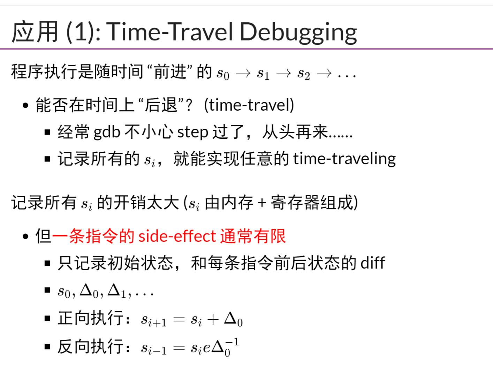
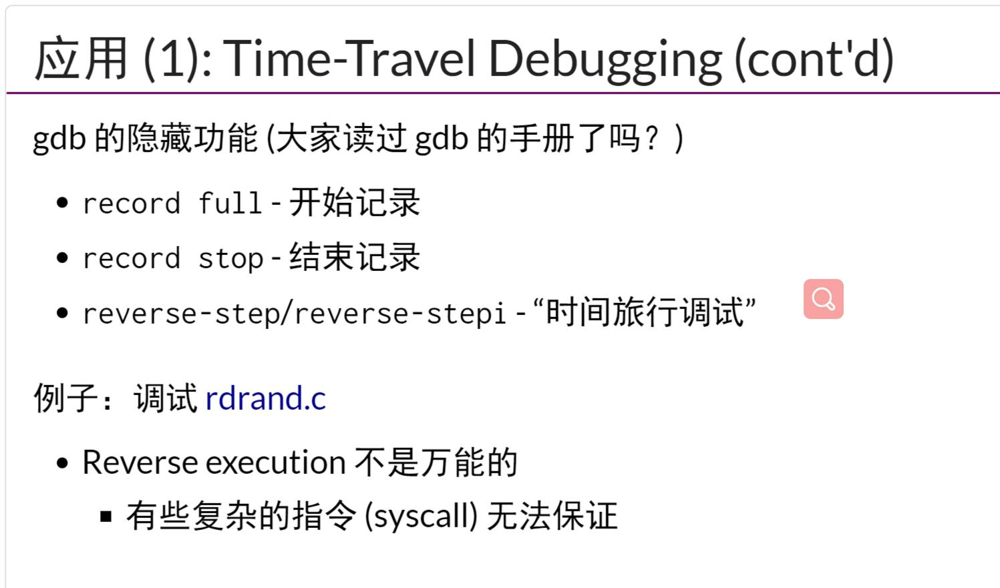
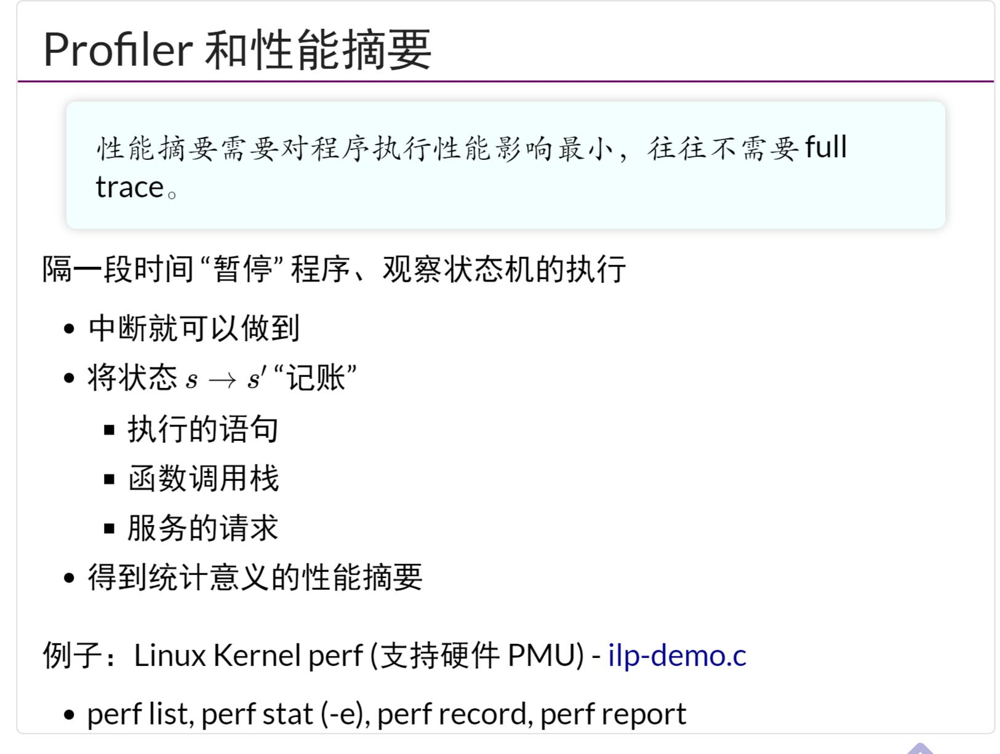

## 编译器和现代处理器
- 源代码S(状态机) -> 二进制代码C(状态机)
    - 编译优化的正确性在于`S与C的可观测行为严格一致`
- `超标量/乱序执行处理器`，运行在状态机上跳跃
## 正向/反向调试，执行重放
- 通过记录每条指令的`side-effect`,得到每条指令执行后产生的变化,这样可以实现`gdb的回放功能`
    - `record full` 开始记录
    - `record stop` 结束记录
    - `reverse-step/reverse-stepi` 时间旅行调试
## Profiler/采样状态机
- 隔一段时间区暂停程序，观察状态机的执行，`得到统计意义的性能摘要perf`