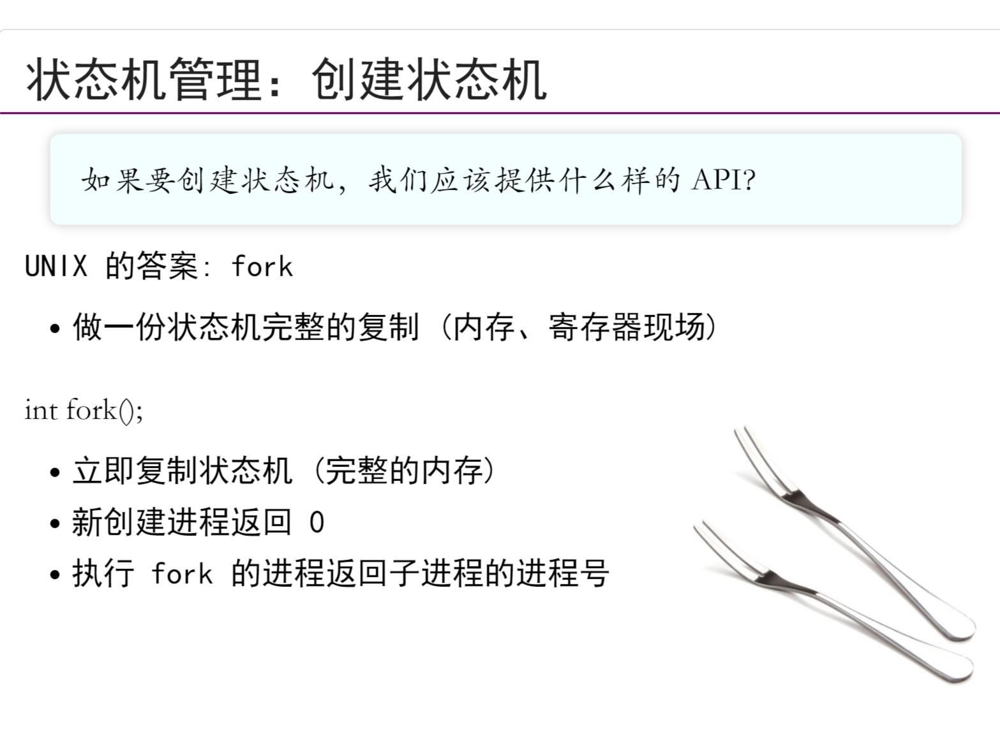
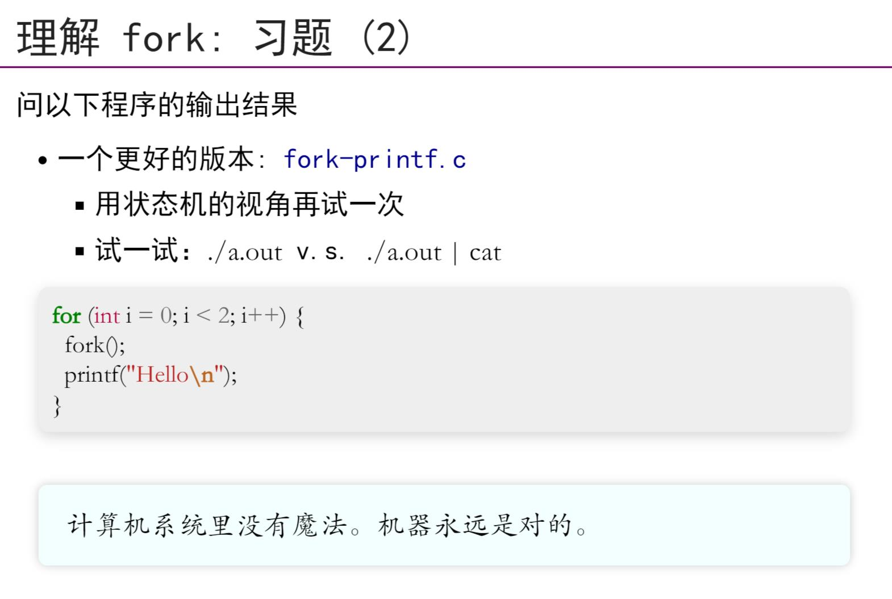
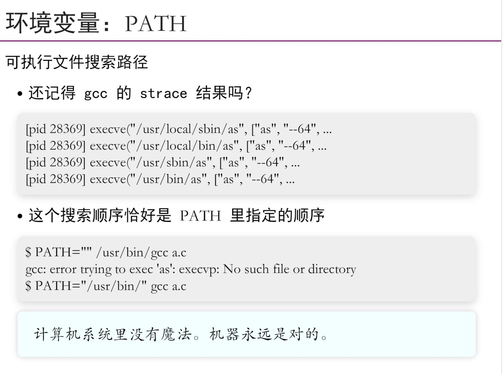
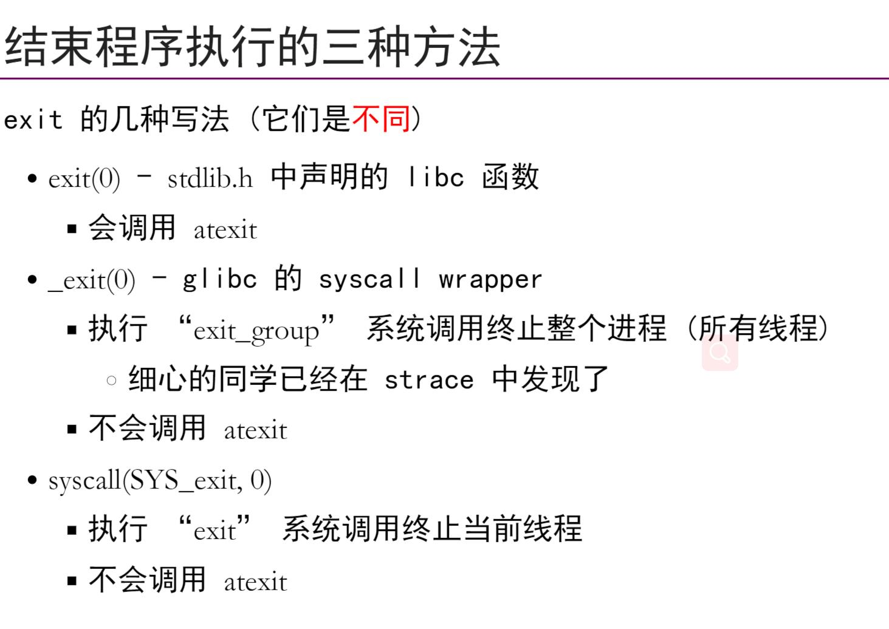

## 最小Linux:一个程序创造全世界
- 操作系统在启动之后到底做了什么
    - CPUReset -> Fireawre -> Boot Loader -> Kernel_start()
    - 如果没有指定启动选项init=，按照“默认列表”尝试一遍
    - 之后，Linux Kernel就进入后台，成`中断/异常处理程序`
    - OS会加载`第一个程序`
- OS为所有程序提供了API
    - 进程(状态机)管理
        - fork,execve,exit状态及创建/改变/删除
    - 存储(地址空间)管理
        - mmap-虚拟地址空间管理
    - 文件(数据对象)管理
        - open，close，read，write-文件访问管理
        - mkdir，link，unlink-目录管理
## fork()
- fork用来创建状态机,此时OS可以看作状态机的`管理者`,虚拟化就是OS可以管理好多状态机，可以选择任一个状态机执行
- `stdout`具有`line buffer(也就是看到'\n'就刷缓存)`;`pipe/file`具有`full buffer(写满4096B之后才刷缓存)`那么这个程序的执行就会有不一样的结果
## execve()
- execve用来重置状态机，`executes the program referred to by pathname`
- `PATH环境变量`，在strce时，会去基于PATH尝试多次`execve`
## exit()
- exit用来销毁状态机，`terminate the calling process`
- 有三种exit