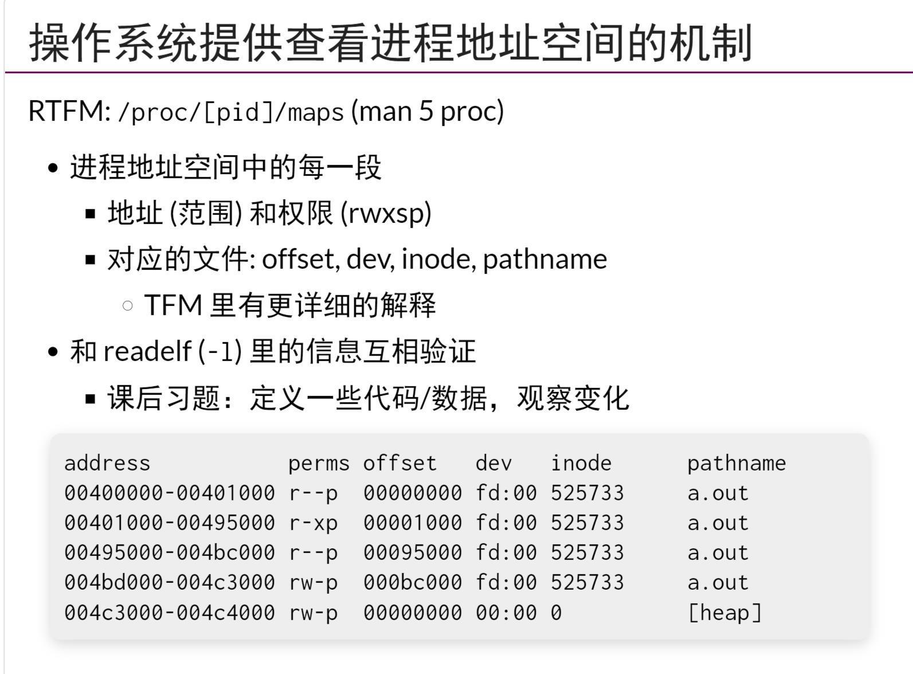
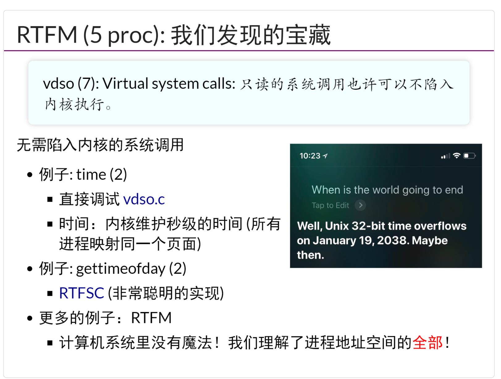
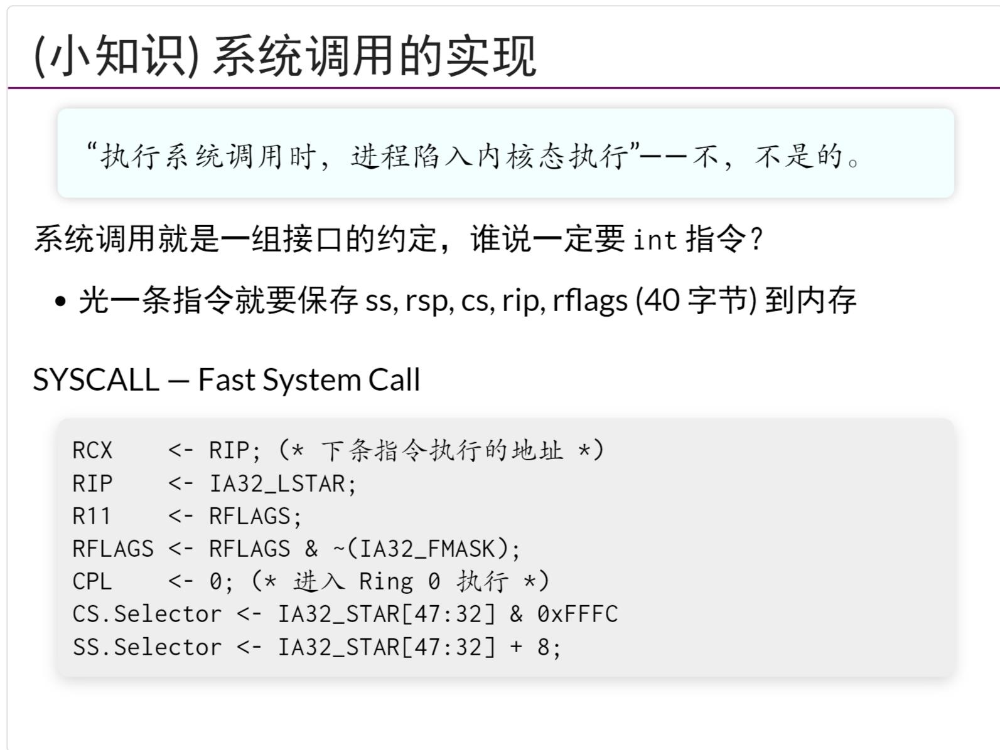
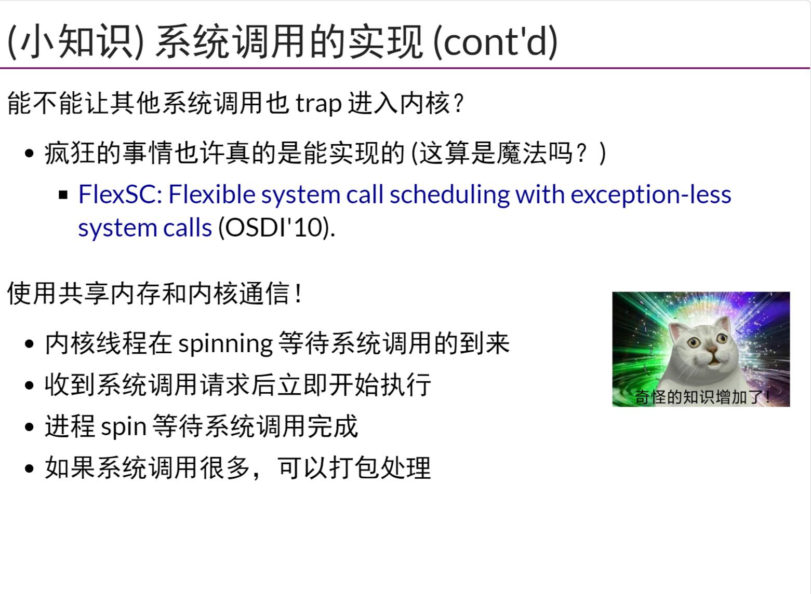
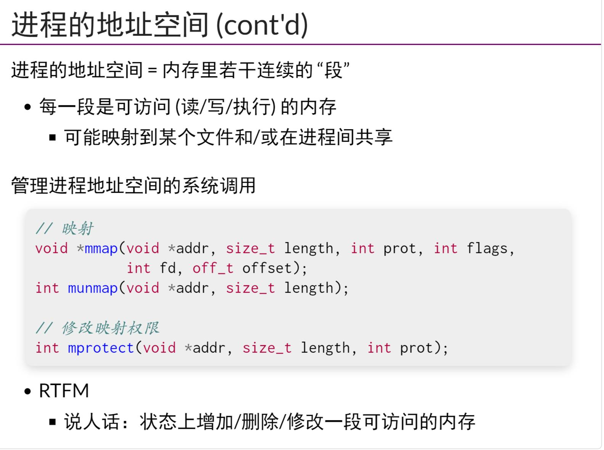
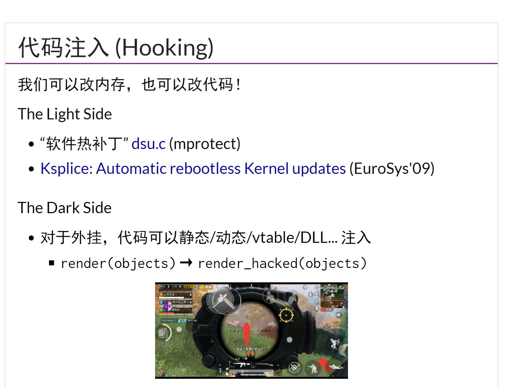

## 最小/静态/动态链接程序的地址空间
- `pmap`指令可以查看进程的地址空间，可以与`readelf -l`相照应
## vdso:非陷入系统调用
- 每个进程中都存在一个区域,称为`vdso`，其中每个进程这段区域的虚拟地址空间都映射到同一个物理页面，通过这个物理页面的信息可以实现`非陷入系统调用`
- 快速的系统调用??能不能让其他系统调用也trap进入内核??这里是不是少了个`不`?
## 进程地址空间管理:mmap
- 通过`mmap`来映射进程地址空间的一段内存到文件/或在进程间共享
- 使用`mmap`可以轻易的实现`ELF loader`
- `mprotect`可以用来修改映射权限
## 突破进程隔离:游戏修改器和外挂
- 每个进程都有自己虚拟的`进程地址空间`，一般一个进程不能够去修改其他进程的`内存内容`，但是为了支持`调试器`，OS有必要支持支持这个功能
- `代码注入`，