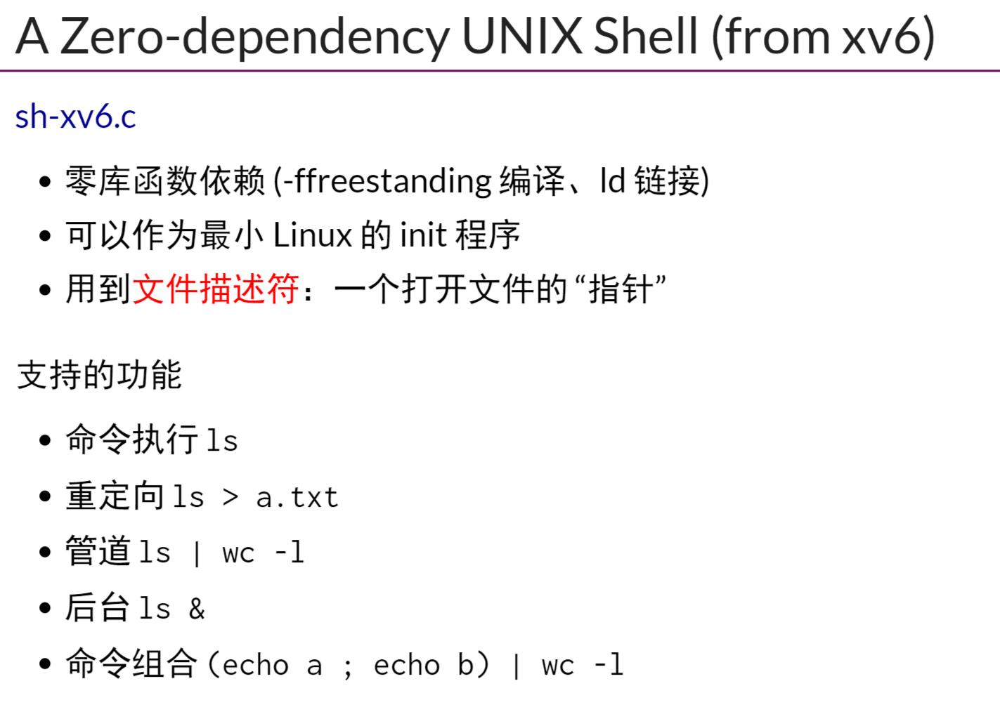
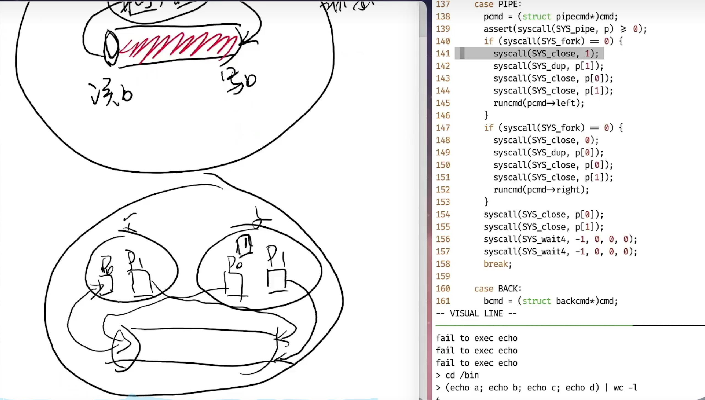

## Shell 简介
-  `Shell`内核提供系统调用，Shell提供用户接口
- `Shell`是一个`解释器`，是一门把`用户指令翻译成系统调用的语言`，在这里`OS`可以看作`系统调用的执行者/中断的管理者`
- `sh-xv6.c`,支持
    - 命令执行，ls
    - 重定向，ls > a.txt
    - 管道，ls | wc -l
    - 后台 ls &
    - `零库函数依赖(-ffreestanding)`
- 用`gdb`调试运行`sh-xv6.c`需要设置`set follow-fork-mode/set follow-exec-mode`
- 对于`;`的执行
    - 先fork的子进程执行左边，之后父进程执行右边，但是子进程不会去执行右边的吗？不会，`exec`系统调用会使得子进程执行了命令，就不返回了
- 对于`|`的执行
    - 也就是将父子进程的对应`stdout/stdin`通过`syscall_close，syscall_dup等`系统调用关联到管道读写端，来实现管道
- 对于后台执行`&`的实现
    - 就是`fork`执行，但是不`wait`
- `shell`可以实现，重定向，顺序结构，管道，预处理 ，环境变量，控制流，最小化等
- 这里因为`>`优先级高，那么这个时候还没有`sudo`权限，所以这条语句失败
## 终端和Job Control
- `tty`命令会返回当前`窗口`
- `fstat`识别当前是`tty`还是`管道`,然后就可以使用不同的方法输出内容到buffer
### Session，Process Group和信号
- 注册信号，可以修改比如`Ctrl-C`的默认行为
- 在fork之后，由于父子进程共享一个`tty`,所以`Ctrl-C`信号会被所有两个进程同时接收
- 每创建一个tmux就是创建一个session，每个session有一个controlling terminal
- `shell`的外面是`libc`？