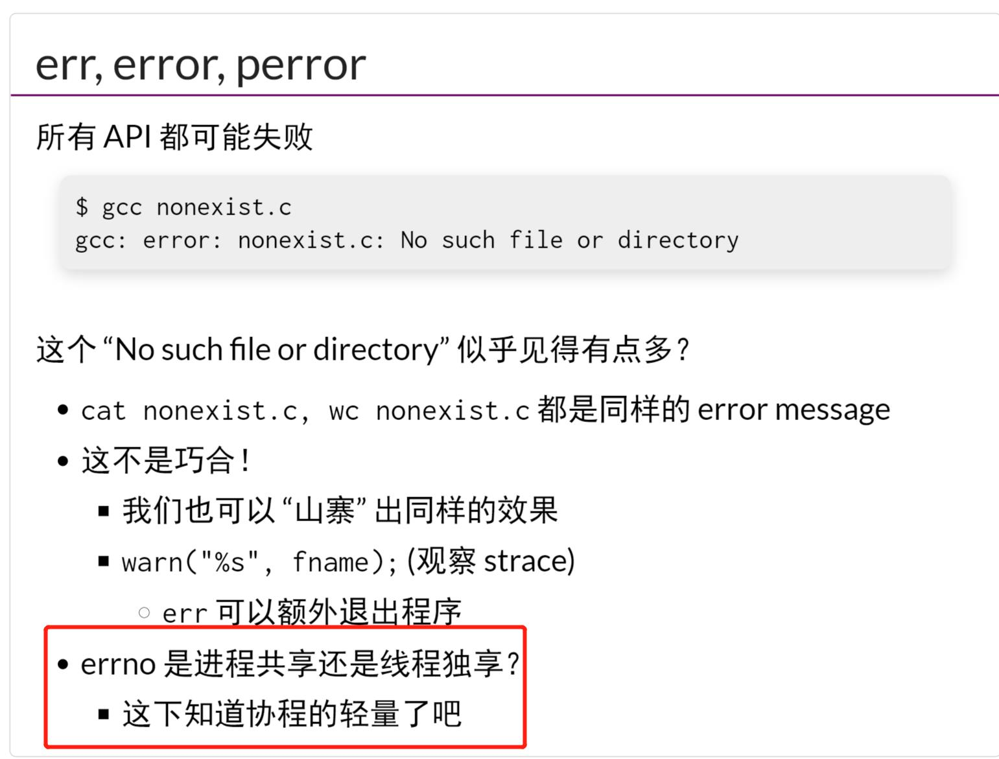
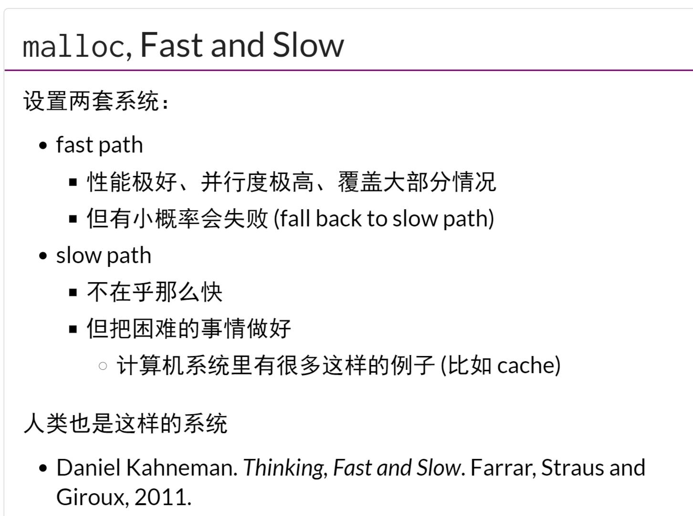
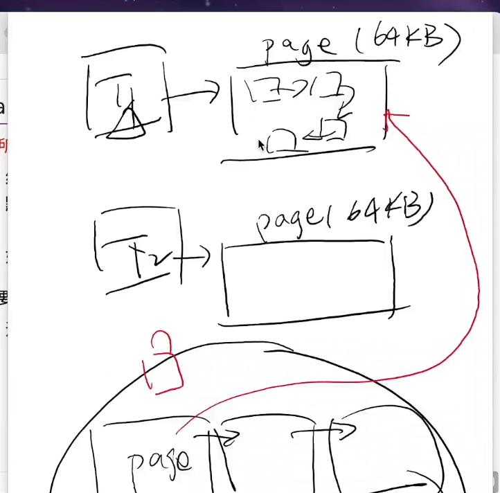
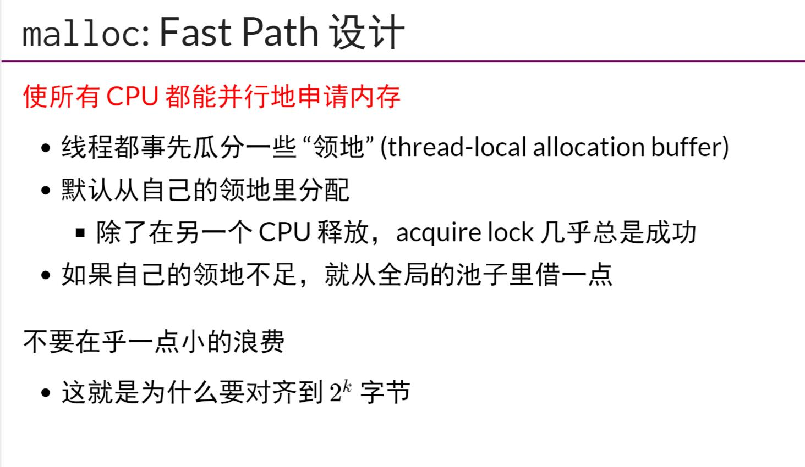

## 系统掉用和计算的封装
- `裸奔编程可行`但是不好用
- `标准库`只对标准库内部数据的线程安全负责
## 文件描述符和进程状态的封装
- 这里如何看出协程的轻量？
## malloc和free
- malloc中存在两种策略
    - fast path是首先给一个线程一次分配大点的页，之后在慢慢从该大的页中细粒度分配，就不用加锁了
- 所以一般的工业分配器，都是先分配大块，然后有`thread_local_block`