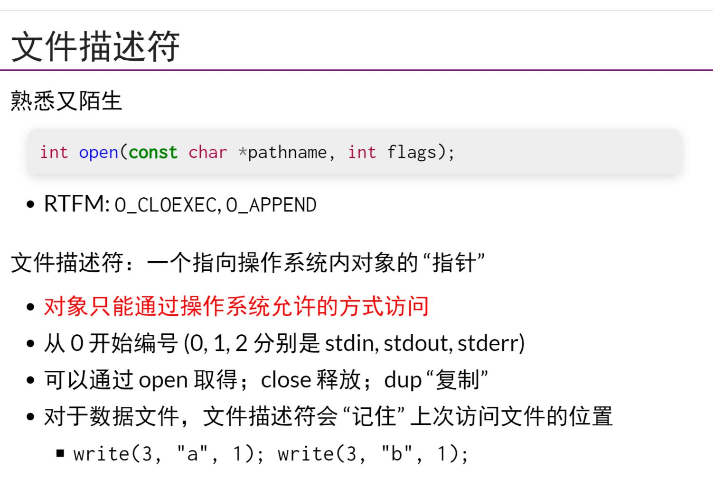
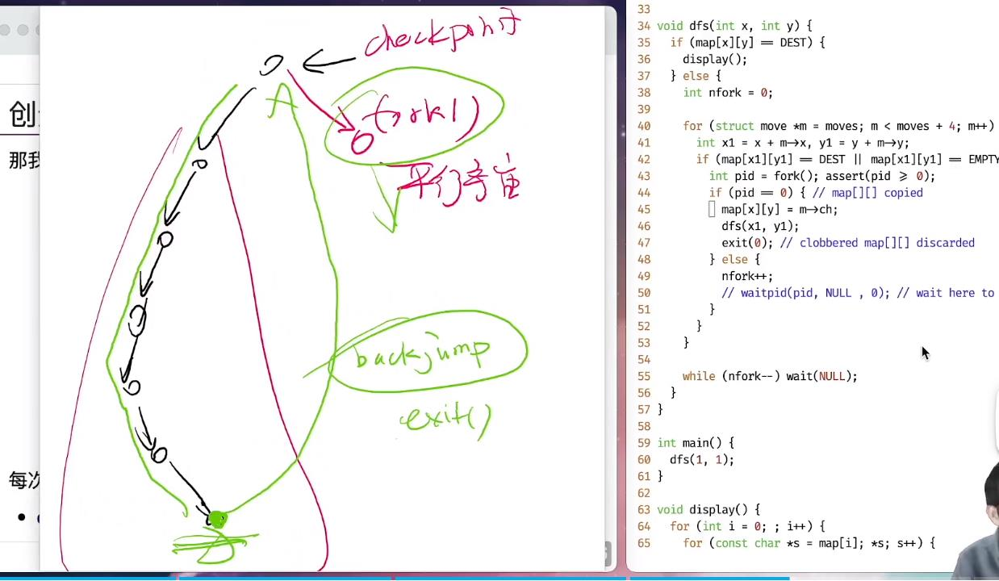
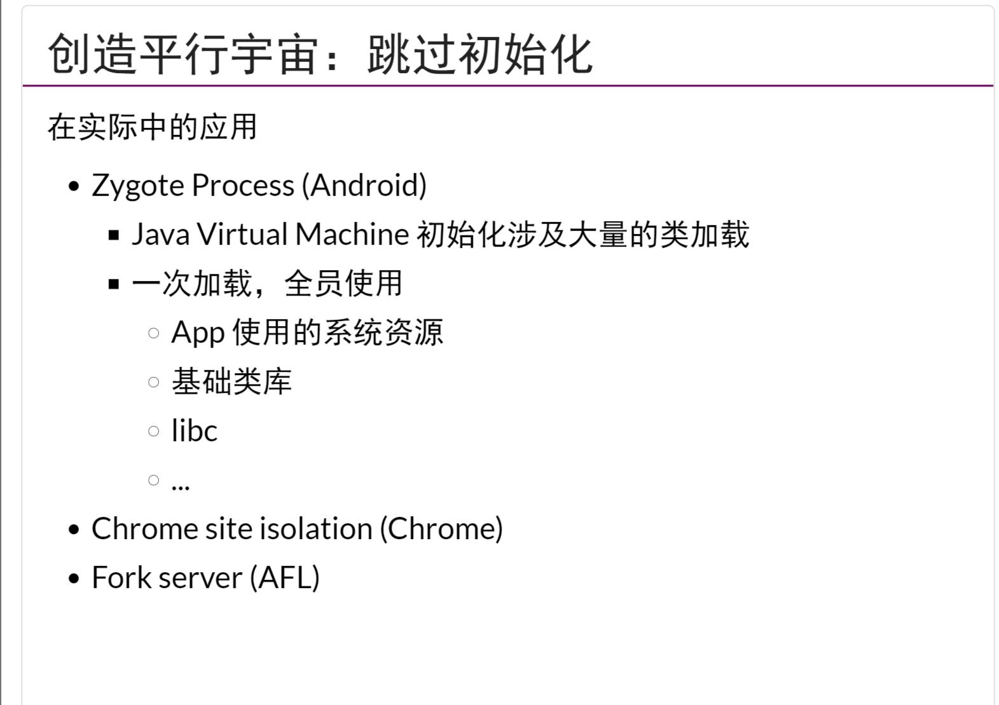
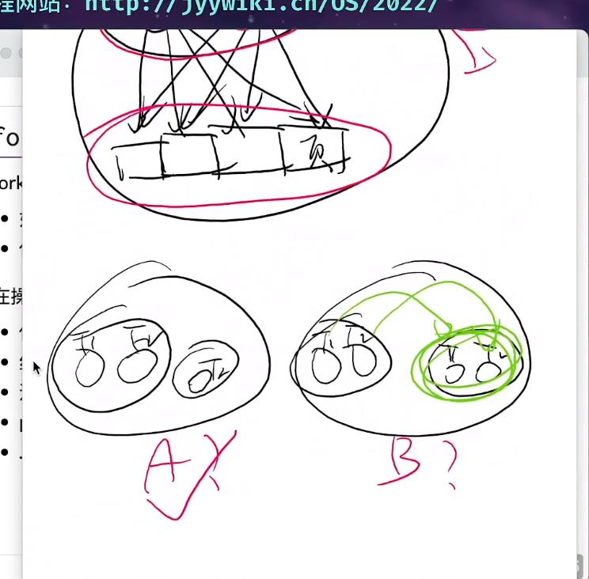
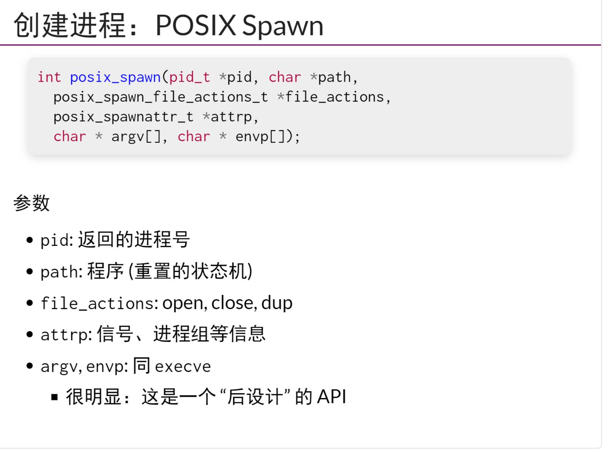
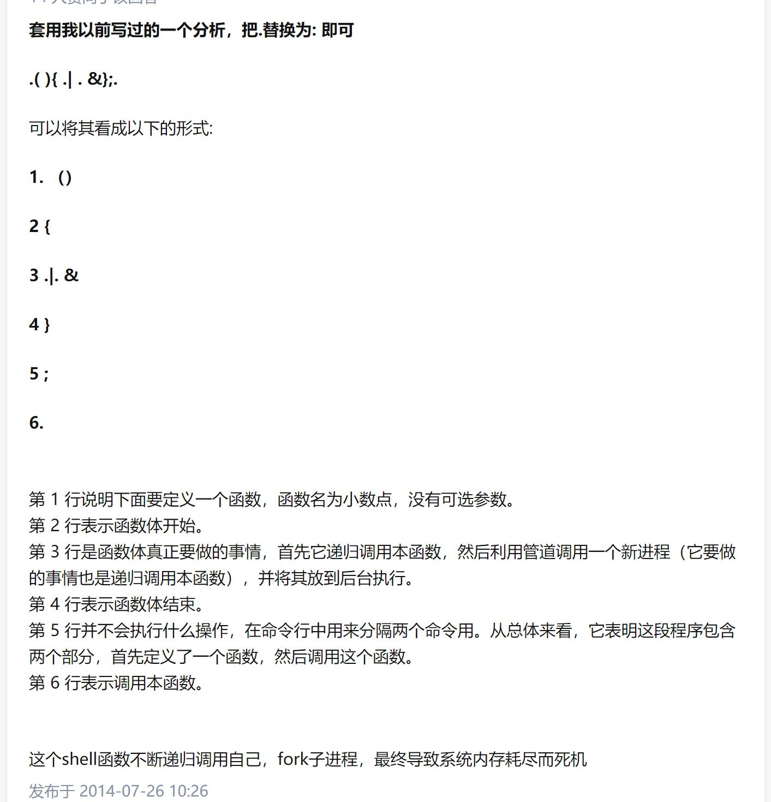

## Overview
- 系统调用->libc->shell->应用的`软件栈`
## 文件描述符的复制
- 对于数据文件，文件描述符号会`记住`上次访问文件的位置
    - open的`O_CLOEXEC`标志可以使得open之后获得的fd在`execv`之后不再`继承`(默认行为是继承)
- fork，状态机的复制，并不是完全的复制，比如fd的复制,fd虽然复制了，但是`内存都会被共享`
## 写时复制
## 平行宇宙和魔法
- fork类似于创建计算机世界的平行宇宙
    - 使用`fork`来实现回溯，可以更快的实现`backjump`，也就是通过`exit`
- Andriod应用通过一个Zygote Process初始化一次，全员使用，达到快速启动所有app的目的
## fork的使用
- 执行fork的线程，只是会复制本身，但是其他线程不会去fork线程的创建是通过一个叫做`clone`的api
- `posix_spawn`类似与`fork + execve`，并且更安全
- `:(){ :|:& };:`会创建一个调用自己的函数,最后`fork_bomb`