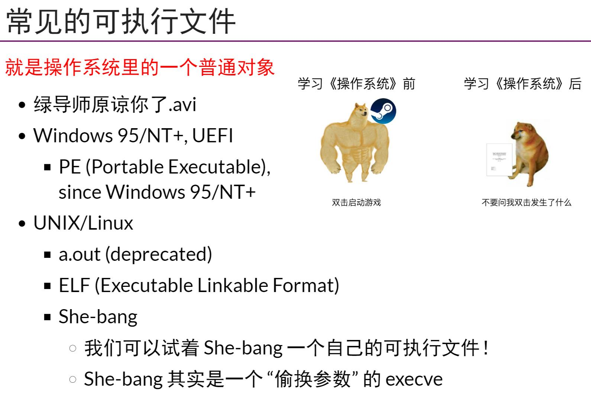

## 可执行文件:描述状态机的数据结构
- 可执行文件描述了一个状态机的初始状态+迁移的数据结构
- `She-bang`本质上是一个偷换参数的`execve`
## 调试信息和Stack Unwinding
- binutils(Binary Utilties)可以用来解析可执行文件
    - ld(链接器)，as(汇编器)，nm(符号查看器)
    - objdump(diassemble二进制)
    - objcopy  
    - addr2line(地址转换为行数)
- 还可以用`调试器`去检查程序运行时状态,`-g -S`查拉吗嵌入汇编的debug info
## 链接与重定位
- 对于链接之前不能识别的`符号地址`,用`0`添上之后可以使用`S + A - P`填上`相对PC寻址`
- 对于编译，汇编，链接的流程理解