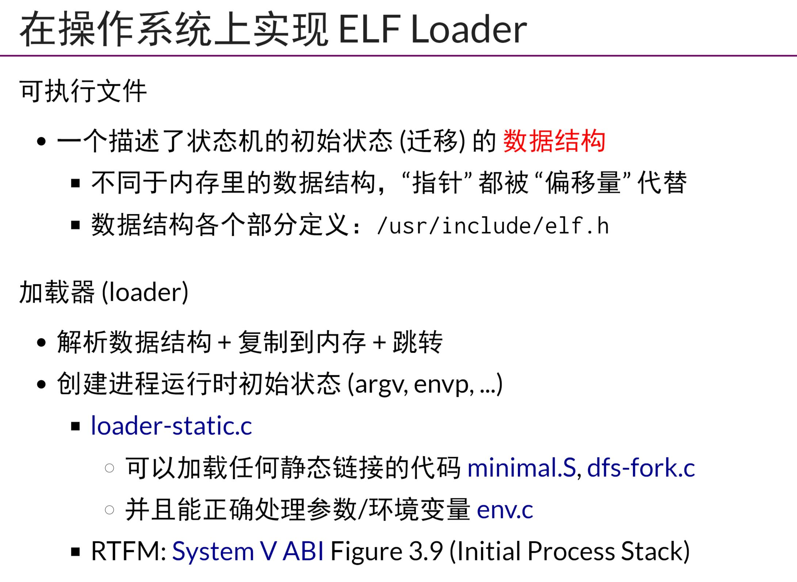
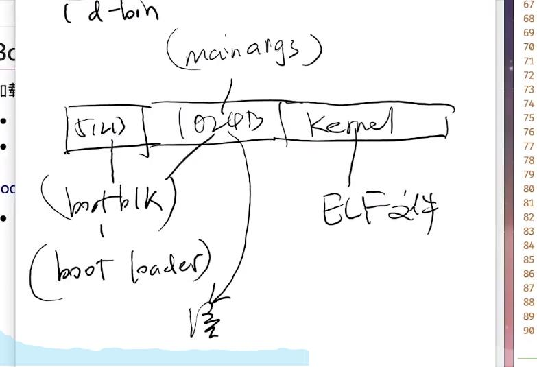

## 用户态加载器
- `用户态加载器`主要是使用`mmap`来映射磁盘elf,它的作用类似于一个loader，会在一开始执行`execve("./loader...)`,但是不会去`execve`它加载的程序地址，而是它自己执行到一半，完全“变成”它加载的程序,比如这里的minmal,
    - loader主要是解析elf数据结构，复制到内存，然后跳转
    - 创建进程运行时的初始状态(argv,envp...)
- 在loader把minimal所需要的`段`都加载到内存中之后，loader需要初始化它的堆栈，包括argv，env
## 启动加载器
- kernel也是一个elf，需要加载到内存中。`bootloader`(磁盘某扇区的前512B)会将后1024B的内核参数(mainargs)读出来,不过这个时候，不能使用`mmap`，因为没有OS，就只能用使用读写磁盘端口的`in/out`指令
- 调试庞大的项目，需要配置好json文件，之后使用`Ctrl + P搜索`
## 动态加载器设计与实现(实现一个完整的工具链，如此硬核)???
- 减少库函数的磁盘和内存拷贝
- 假设编译器可以生成`位置无关代码PIC`，在需要动态加载的地方做标记，之后查表即可
- 所有动态链接都需要GOT(Global Offset Table)与PLT(Procedure Linkage Table)