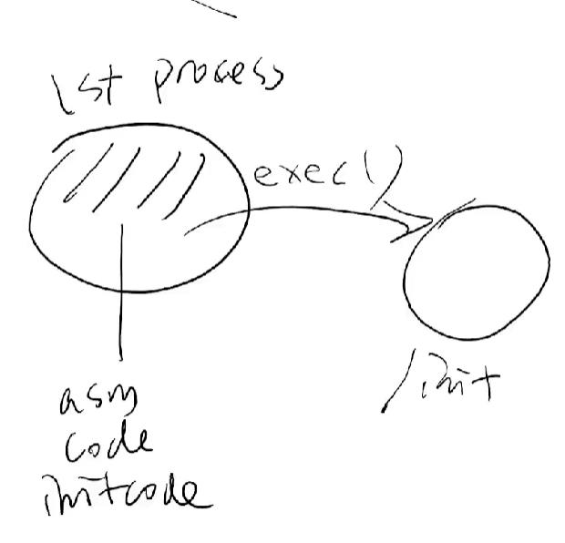

## Unix v6 和 xv6简介
## 构建，配置，代码导读
- `compile_commands.json` 可以使得IntelliSence使用其中的编译信息，达到有效的智能补全/函数跳转，
-  可以使用`bear`命令来使得makefile工程自动生成`compile_commands.json`
- [生成compile_commands.json文件](https://blog.csdn.net/denglin12315/article/details/121853480)
## 调试第一个系统调用
- xv6的第一个程序`initcode`是硬编码在程序中
- `gdbinit`文件是xv6生成的，这个文件是配置文件，在gdb启动的时候会设置好默认参数