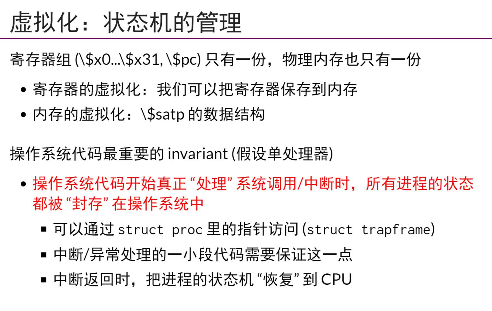
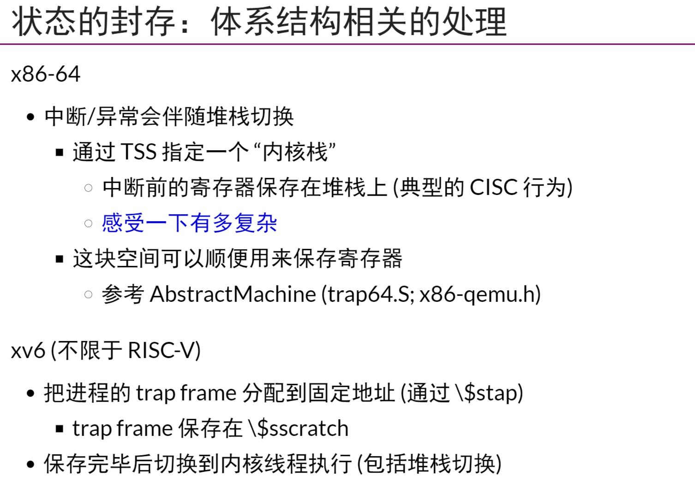

## 上下文切换:概念
- 一个OS存在三种指令
    - load/store
    - reg运算
    - syscall(x86-64)/int $80(i386)/ecall(riscv32/64)
## 状态机的封存
- `ecall`指令最后会跳转到`STVEC`寄存器中的地址
- 将每一个进程的`invariant`(也就是这个状态机被封存了)保存起来，这样OS在每次调度的时候，就可以实现合理的调度,其中`satp寄存器`类似于x86架构中的`CR3寄存器`，用来切换页表
- 在`x86-64`中，中断/异常会伴随堆栈切换，也就是中断前将寄存器保存在堆栈上