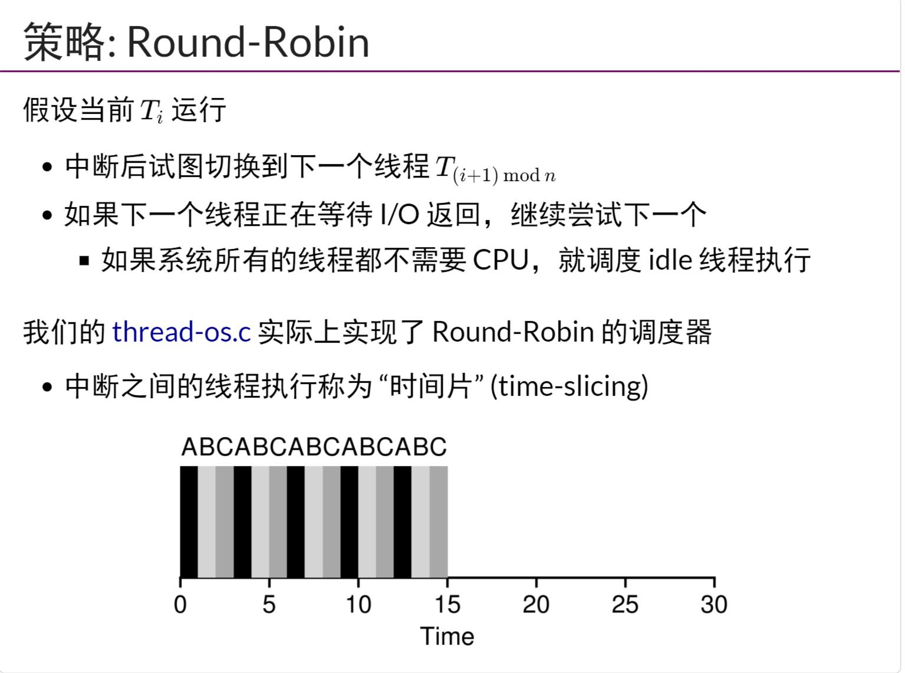
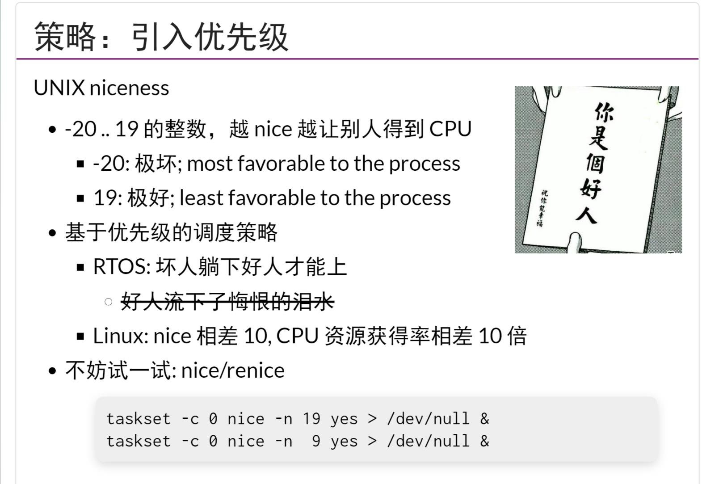
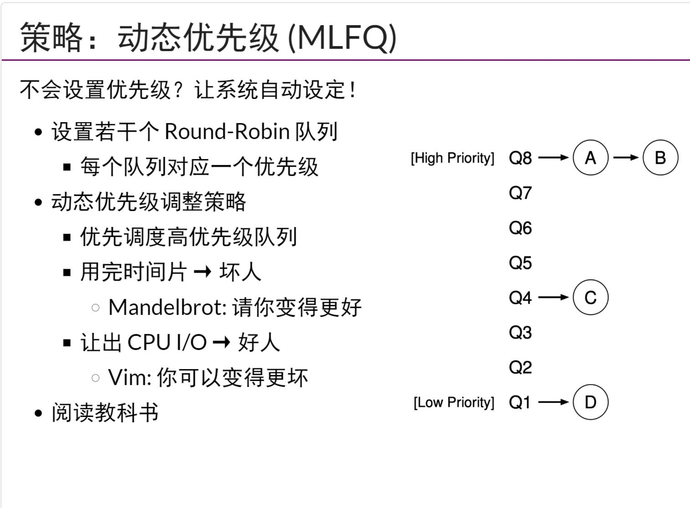
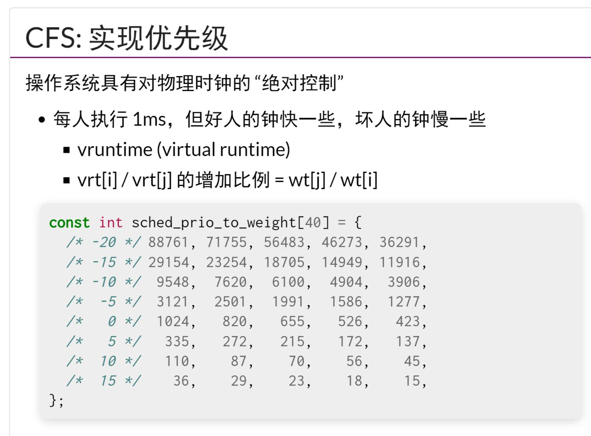
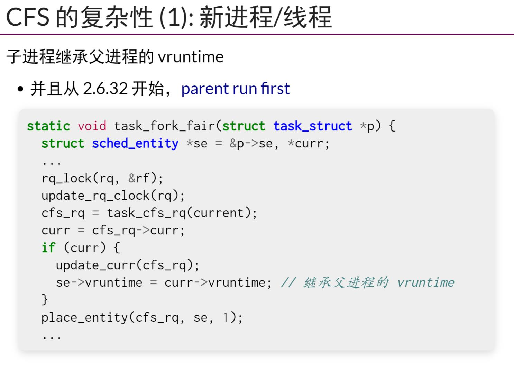
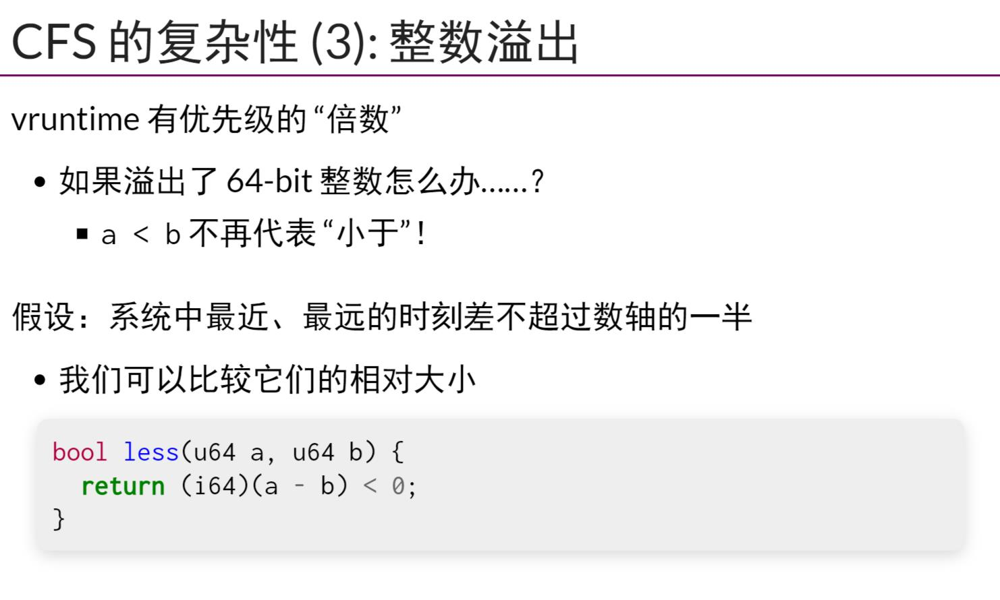
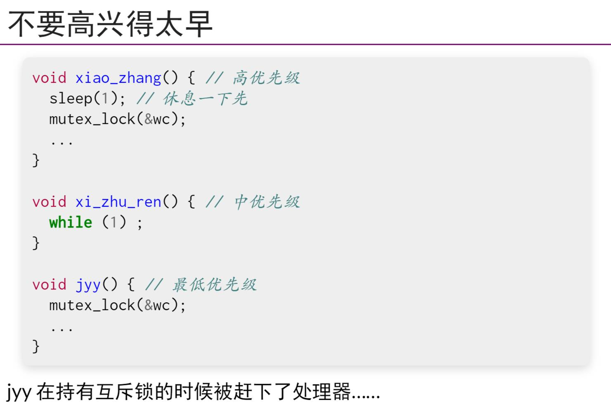
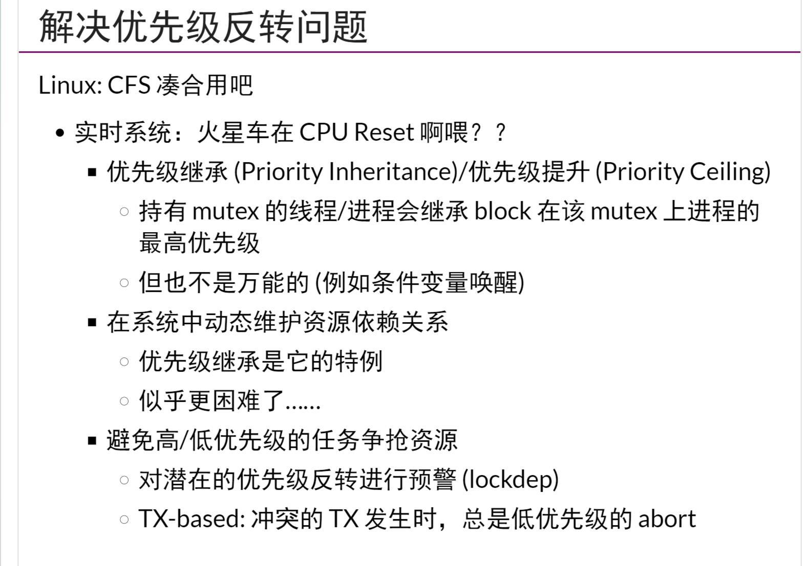
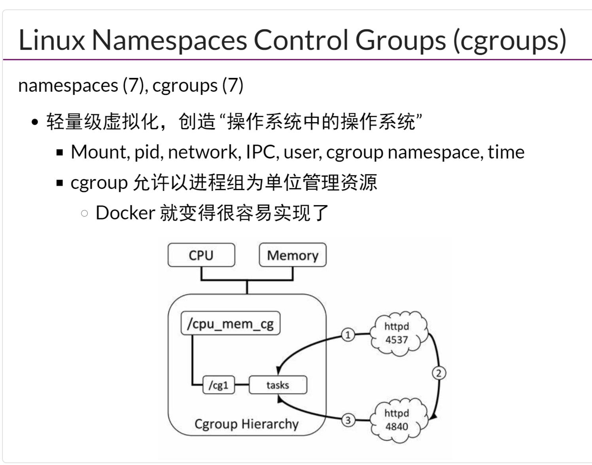
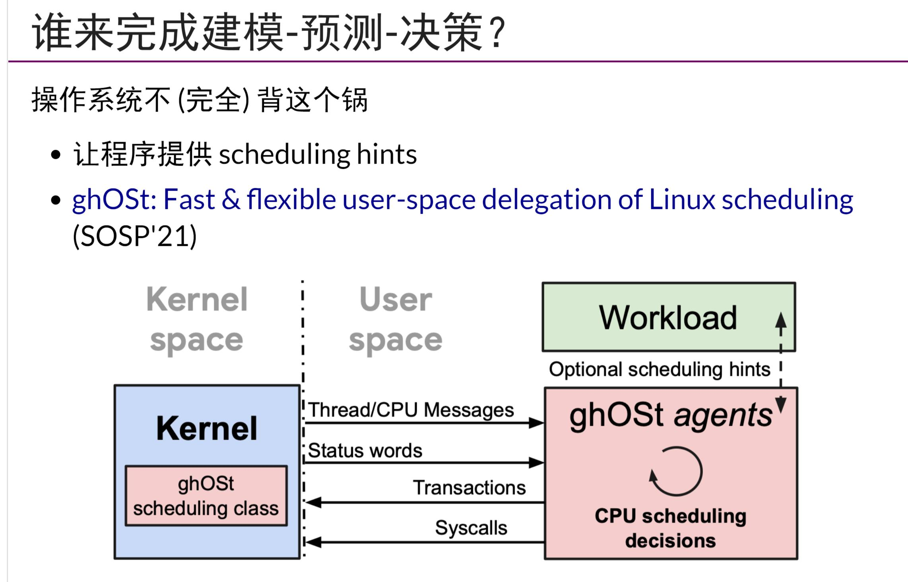

## rr和优先级调度
- `机制`是指提供一个做一件事情的手段(做出来)。而`策略`是指执行这个手段的具体方法(做的好)。比如`机制`可以是上下文切换，但是`策略`是使用何种方式切换上下文，比如Round-Robin,优先级，MLFQ，CFS等
- Linux Kernel可以配置中断频率
- `Round-Robin`就是时间片轮转算法
- `优先级`，设置线程的nice值，可以实现优先级调度，nice在unix中是`-20...19`的整数，线程的nice值越大，越难被调度到。所以优先级高的线程，会完全霸占CPU。甚至对于`RTOS/实时OS`高优先级任务可以一定先执行完，而对于linux并不会完全使得低优先级任务不执行
- `taskset -c 0 nice -n 19 yes > /dev/null &`是指把一个进程指派到一个cpu上，并设置好nice值，nice值为负数表示系统进程
## MLFQ和CFS
- `RR`的缺点在于会卡顿，`MLFQ`多级反馈队列，是动态优先级
- `CFS(Complete Fair Scheduling)`,OS对于物理时钟的`绝对控制`，也就是CFS可以实现优先级，每人执行1ms，但是好人(nice值高)的时钟快一点，坏人的时钟慢一点(nice
值低)，也就是每个线程调度的时间是根据nice值得来的虚拟时间，优先级越高的进程，weight越高
- CFS在工程上有复杂性，fork出来的进程会继承父进程的vruntime，也就是和父进程一样的优先级
    - CFS对于IO密集型的线程，在sleep之后会把它`落后的vruntime`补上
    - 由于vruntime是一个u64，所以可能会溢出，所以在比较时只考虑vruntime的相对大小
    - 使用`红黑树`来存储每个线程的vruntime，还要要考虑`并发` 
## 优先级反转
- 高优先级的线程可能因为锁的问题导致`优先级反转`的产生 有些方法可以解决优先级反转的问题，比如`优先级继承`,`动态维护资源依赖关系`,`避免高/低优先级任务争抢资源`
## 多处理器调度
- 多处理器调度的困难在于,既不能`简单的分配到处理器`，也不能简单的`空丢给谁`(需要考虑cache)
- `Linux Namespaces Control Groups(cgroup)`，OS运行创造`OS中的OS`(轻量级虚拟化)，cgroup运行以进程组为单位管理资源，Docker可以限定容器用多少CPU，多少内存等
- 调度还涉及`NUMA`，所以调度还涉及内存一致问题
- `CPU还可以Hot-plug`
- 甚至可以不完全由OS来执行调度,而是由进程提供scheduling hints