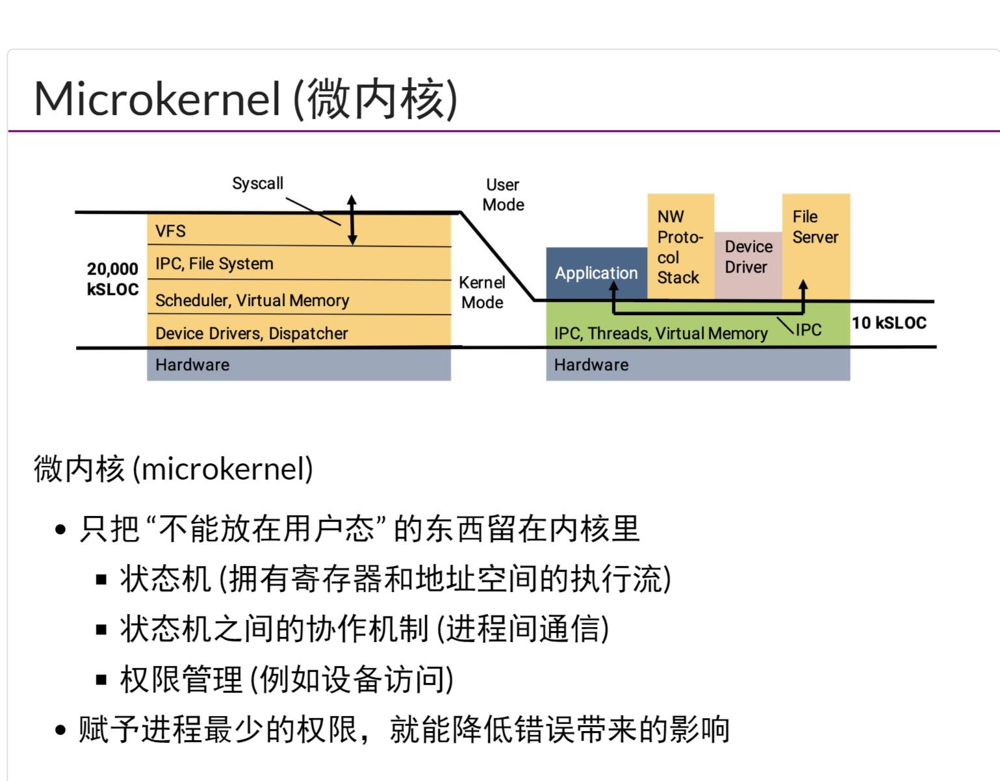
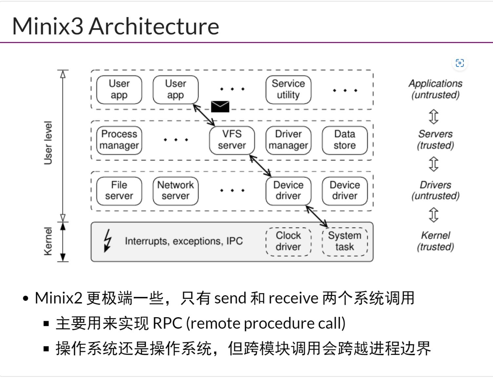
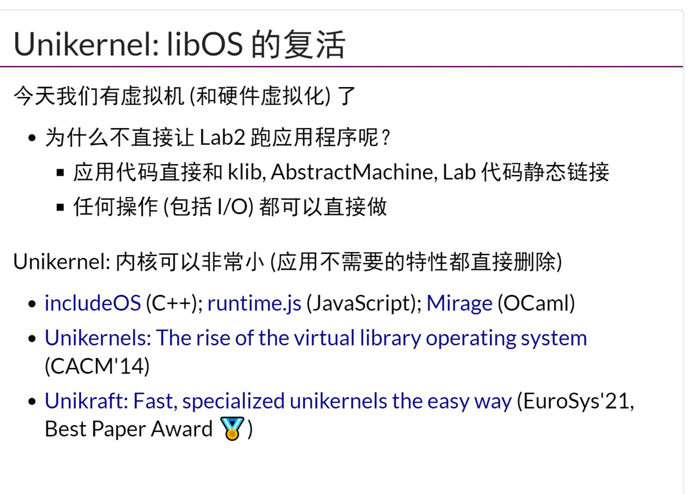

## POSIX和Window API
- OS可以看作是`一组对象+访问对象的API`，OS应该提供什么`API/对象`
- 如果要成为一个领域的专家，那么就需要花很长的时间去了前人做了哪些工作，哪些做的好，哪些做的不好，哪些过时了
- `WSL1`，api层面的虚拟化，在windows上实现linux的api
- `wine`，api层面的虚拟化，在linux上实现windows的api
- OS的api需要保证atomic。比如，如果想要正确的保存一个文件，rename是atomic的，那么保存文件之前，应该先rename创建一个临时文件，然后用rename的方式换回去？但是rename这个syscall可能不是portable的
## 微内核和Minix
- 微内核可以使得`把尽可能多的功能都在普通进程中实现(失效隔离在“进程”级)`,赋予进程最少的权限，就能降低错误带来的影响
- `Minix 大多数`的功能都在用户态，主要使用`send`和`receive`两个系统调用实现RPC
## seL4和证明思路
## libOS
- `Exokernel`,OS甚至连`进程`的概念都没有，只有时间片，`库函数OS`？
- `Unilikernel:libOS`，没有用户态