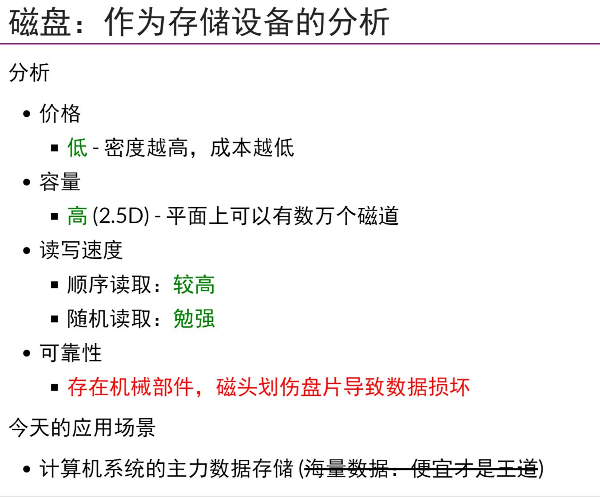
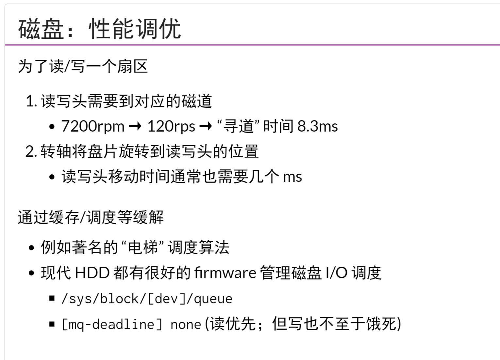
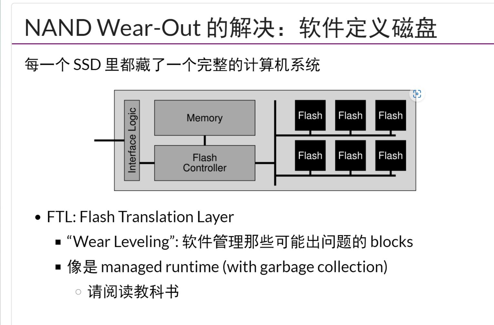

## 状态机状态的存储
- 物理世界的状态保存01值
- 机器指令模型只有两种状态
    - 寄存器
    - 物理内存
- 需要实现
    - 可以寻址
    - 访问速度尽可能快，所以有了memory hierarchy,`甚至为了读写更快，不惜规定在掉电之后丢失数据`
- `coredump`是指在一个程序运行时，出错的时候把程序的状态转储到一个core_dump文件，对于不好复现的程序，这样做很帮助,使用`ulimit -c unlimited`指令可以开启coredump功能，coredump起源于`磁芯存储`
## 磁(持久存储) 
- 使用电磁感应来实现持久存储，磁带的随机读取很差，顺序读取也需要等定位，知识和`冷数据存档和备份`
- `磁盘`仍然是当今计算机的主要存储
- 诸如`电梯调度`等调度算法不再是由OS来完成了，而是`磁盘上的OS`来完成，现在的磁盘上自己就带有`CPU/DRAM...`,这就是`SOC`了。这个时候OS就把磁盘看作`block`的序列
- 现在的磁盘调度器只有两种，一种是`mq-deadline`(使得磁盘读更优先，写也不至于饿死)，一种是`none`
- `软盘`可以看作是`硬盘脱离读写头`
## 坑
- `你总是可以使用一个append-only的数据结构实现一个持久化的数据结构`
## 电
- 机械部件可靠，而且有延迟，使用flash memory可以实现`闪存`
- flash memory(存储电子来代表01数据)容量越大读写越快
- 今天的SSD已经解决了flash memory`读写次数限制`的问题，每个SSD里都藏了一个完整的`计算机系统`,采取类似`虚拟内存`的方式(FTL Flash Translation Layer)