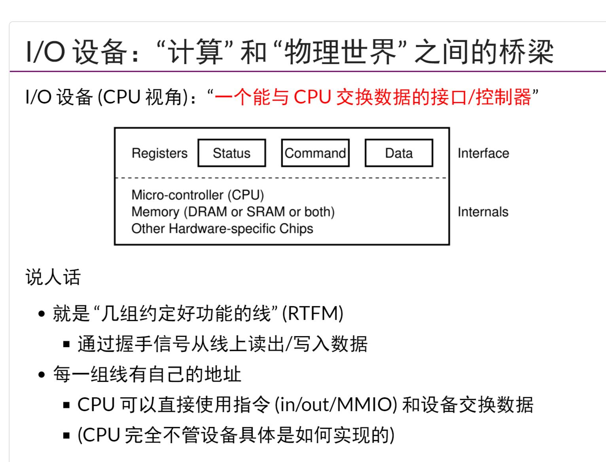
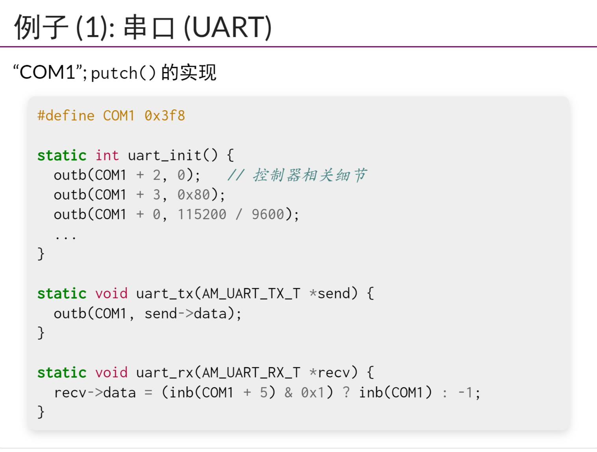
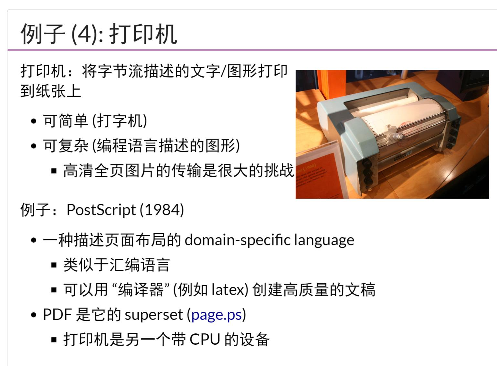
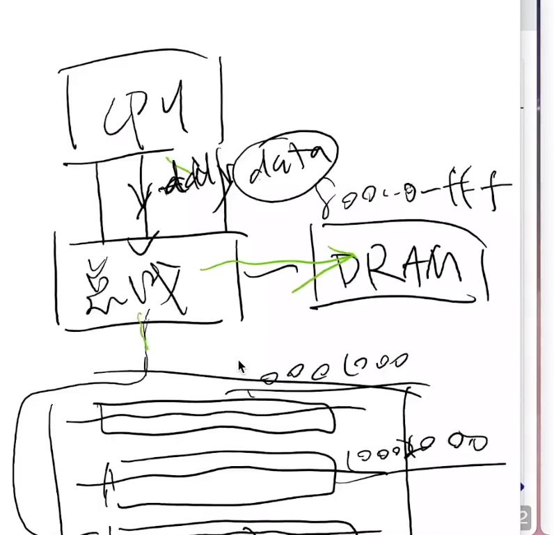
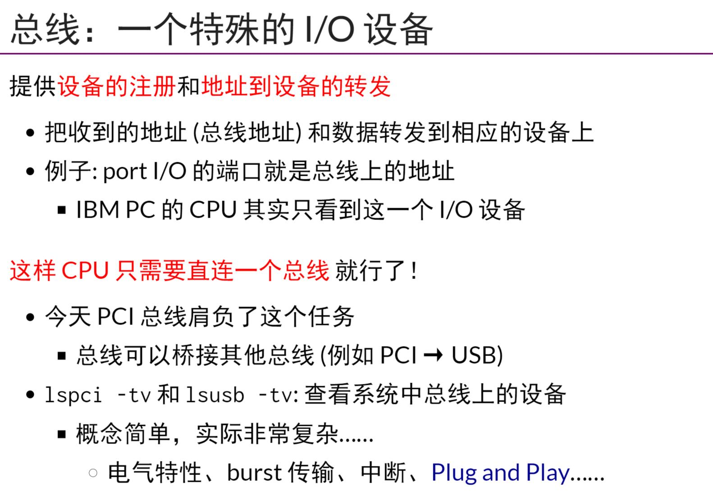
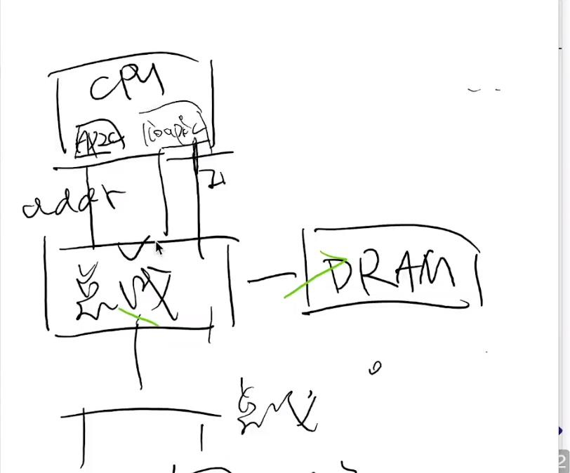
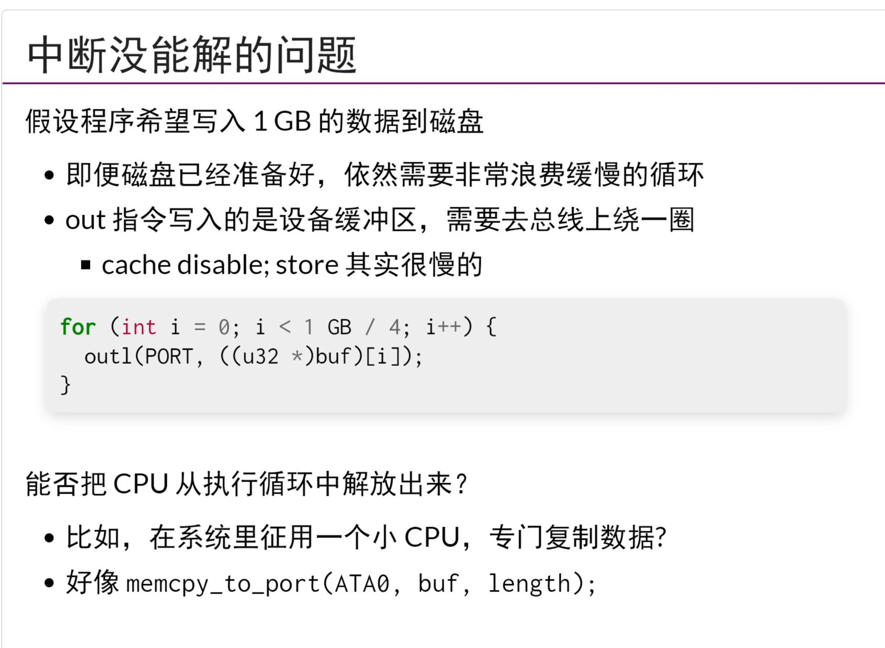
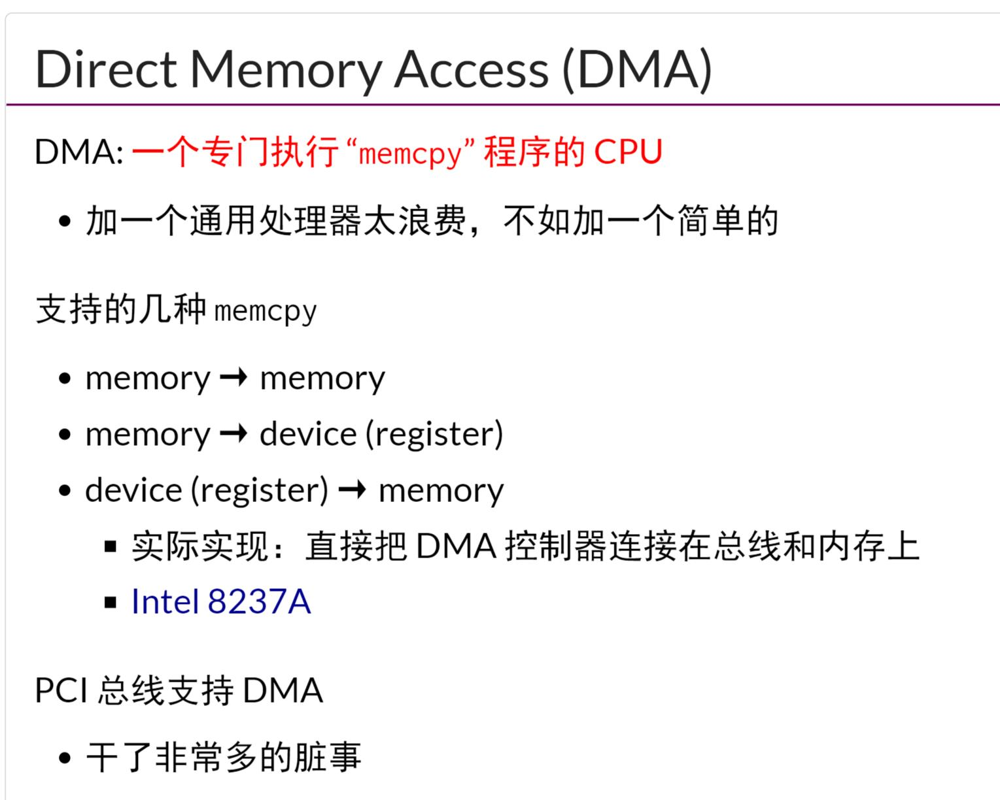
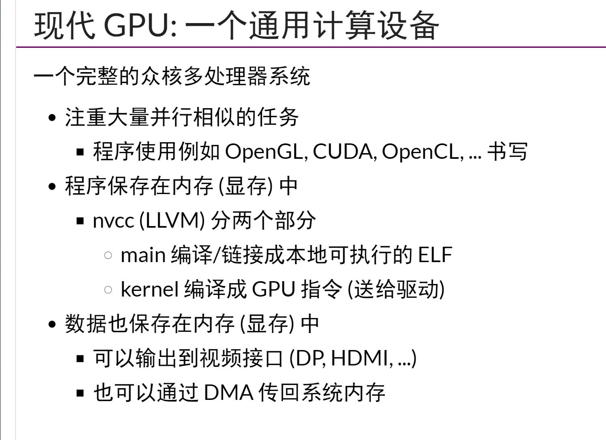

## 设备模型:UART/键盘/磁盘/打印机
- `CPU把IO设备`看作是可以交换信息的接口`Status/Command/Data`
- 对于`使用UART的串口设备`，读写数据就是读写寄存器(或者叫做设备的端口)，printf底层使用的是`putch()`
- 键盘控制器，x86中有两个端口,0x60(data)，0x64(status/command)
- ATA/IDE接口磁盘
- `打印机`,将字节流描述的文字/图形打印到纸上，一般就是pend(用来设置画笔是否悬空)，以及两点之间的坐标，画笔颜色，就可以画出一条线,postscript是一种用来生成高质量矢量模型的协议，`一种用来描述页面布局的编程语言`
## 总线，中断控制器和DMA
- 为了`扩展性`，CPU只直接连接一个IO设备(也就是总线)，总线可以连接多个插槽,甚至`内存`也连接到总线，然后给内存与其他IO设备编址(memory IO)`现在几乎所有的设备可以热插拔`
- `中断控制器PIC(programmable interrupt controller)`,CPU有一个中断引脚，收到某个特定的电信号会触发中断，保存5个寄存器(cs, rip, rlfags, ss, rsp)，跳转到中断向量表对应项执行，CPU中存在中断控制器
- `中断没能完全解决的问题`,中断没能够解决把数据从磁盘大量传递到内存慢的问题。`DMA`可以看作一个专门执行`memcpy`程序的CPU，实现方式是直接把DMA控制器连接到总线和内存上，DMA也是一种IO设备，也连接到总线上
## GPU和异构计算
- DMA是一个做一件特别事情的CPU(制作memcpy的CPU)，
- `任何一个n变形都可以分解成为n-2个三角形`
- GPU可以看作是一个`完整的众核多处理器系统`
- `异构计算`就是一个SOC上存在多种计算单元,比如CPU/GPU/NPU/DPU