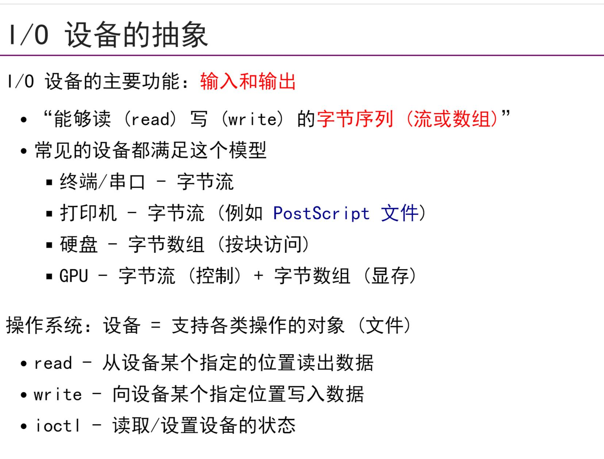
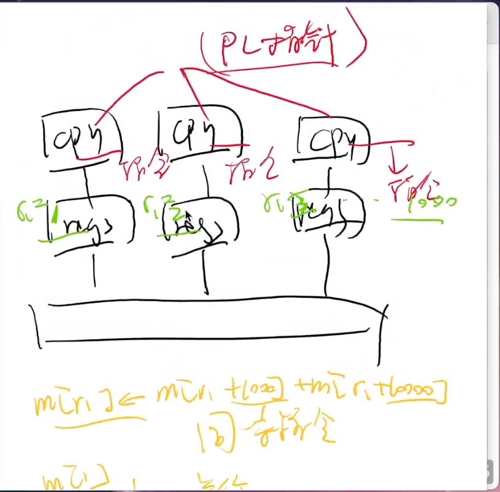
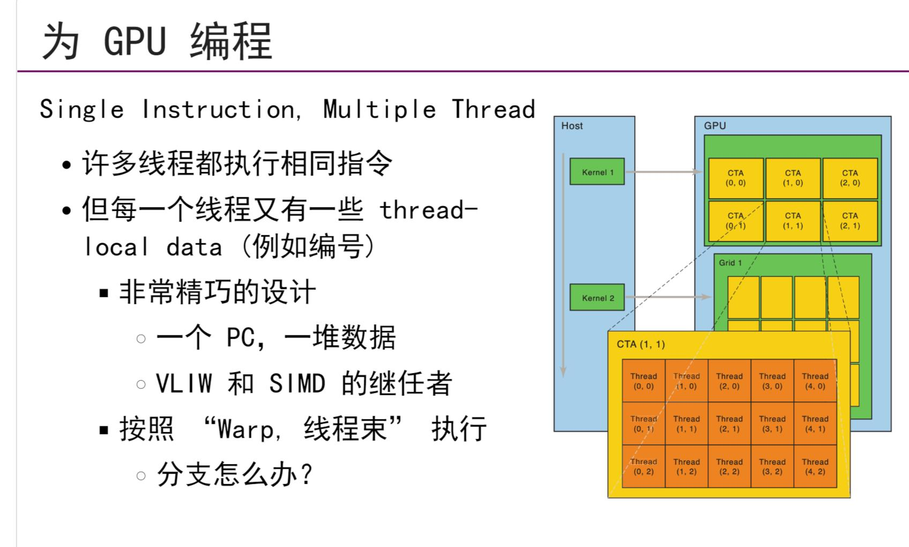
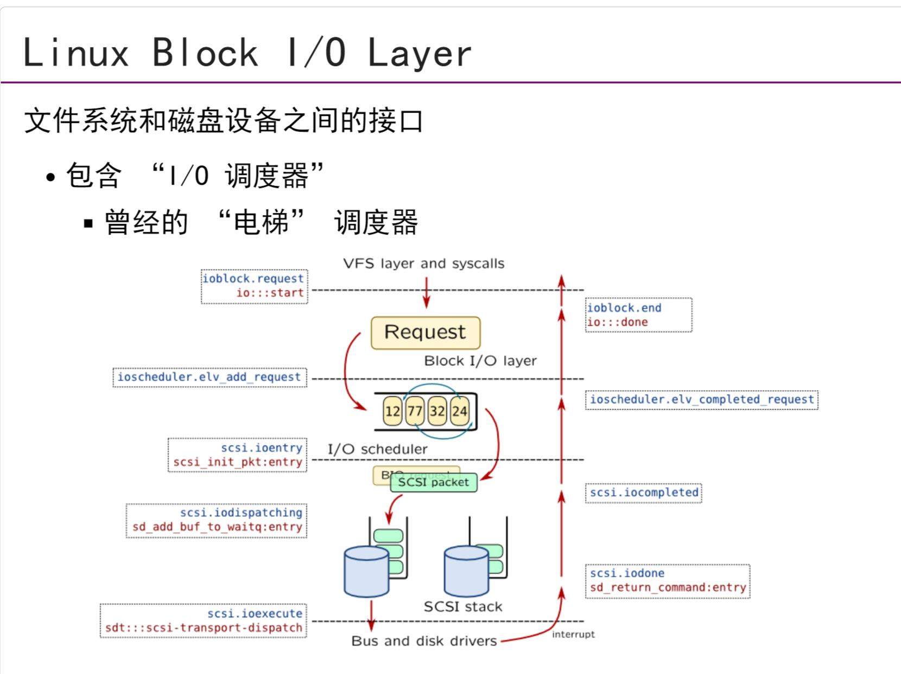

## 设备驱动原理
- 任何IO设备可以看作是`一组寄存器和一组协议`，一般是一个设备一个协议，每种设备协议不一样
- `设备驱动程序`就是将IO设备抽象，`读写字节序列`,`设备驱动程序`需要将`read/write/ioctl`翻译成为设备寄存器可以听懂的话
- `driver`可以类比`shell`，你输入的一组shell命令可以被翻译为一组系统调用,`driver`就是一段代码，对于设备驱动程序，完全可以不需要真实的设备，而是单纯的执行设备驱动代码来模拟设备
- 比如`/dev/null`，它的驱动代码逻辑就是，如果去写它，那么就会直接返回成功，如果去读它，那么就会显示该设备没有内容
- `driver`都是内核代码，所以需要保证安全
- 实际上大多数的IO设备都是由ioctl实现的
## 设备驱动原理
- `内核模块`是一段可以被内核动态加载执行的代码。在内核中初始化，注册设备，系统调用直接以函数调用的方式执行驱动代码
- 一个设备驱动编译完了之后，`.c`会变成`.ko`,可以被linux内核动态加载
## 为GPU编程
- `GPU也就是显卡`,显卡可以看作是有好多个CPU与有一个共享内存的计算系统,GPU的架构是`Single Instruction, Multiple Thread`,多个CPU共享`取指令，译码`，这样可以节省电路，并分开`执行`。多个CPU共享一个PC指针，但是在它们不一样的寄存器中存不同的值，这样一来，虽然执行同样的指令，但是执行的结果不一样
## 存储设备
- 存储设备一般可以看作`block device`,linux在文件系统和磁盘设备之间存有一个接口