## 在应用间共享存储设备
- 设备在应用之间共享存储设备需要处理好`竞争`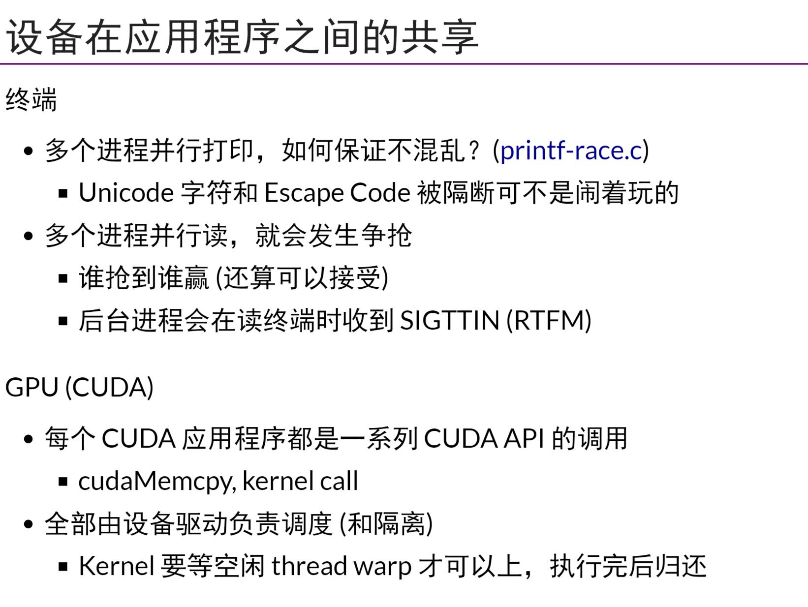,`printf函数`保证了线程安全
- 如果直接把`共享磁盘`完全暴露给应用程序，一个程序bug操作系统就没有了，所以需要在应用程序与共享设备之间加一层抽象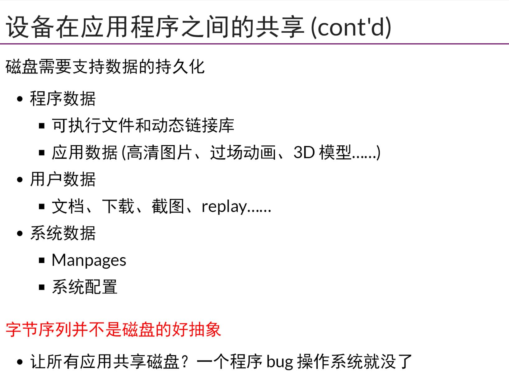
- 所以文件系统应运而出，设计目标是
    - 提供合理的API使多个应用程序能共享数据
    - 提供一定隔离，使恶意/出错程序的伤害不能任意扩大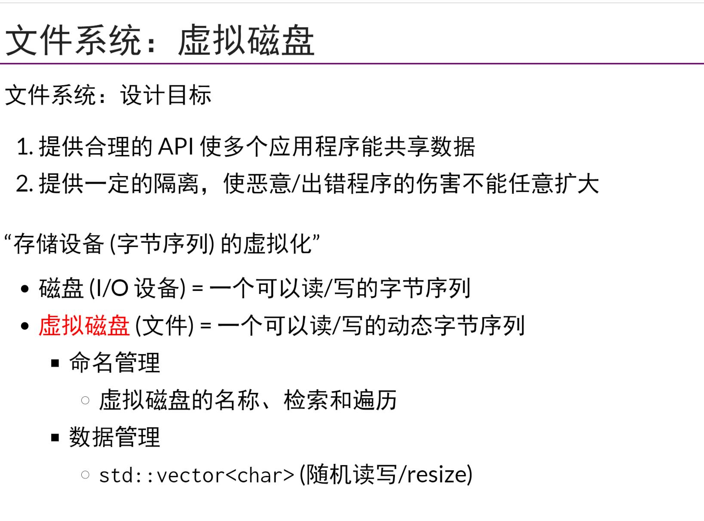
- 文件系统可以看作是一个虚拟磁盘(文件)组的管理者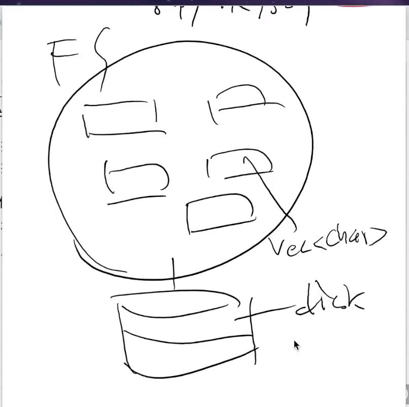,可以看作是一个应用程序，所以想要读写文件的程序，都可以和FS(文件系统)做进程间通信
## 文件系统和设备，mount原理
- unix中运行任意目录挂载一个设备代表的目录树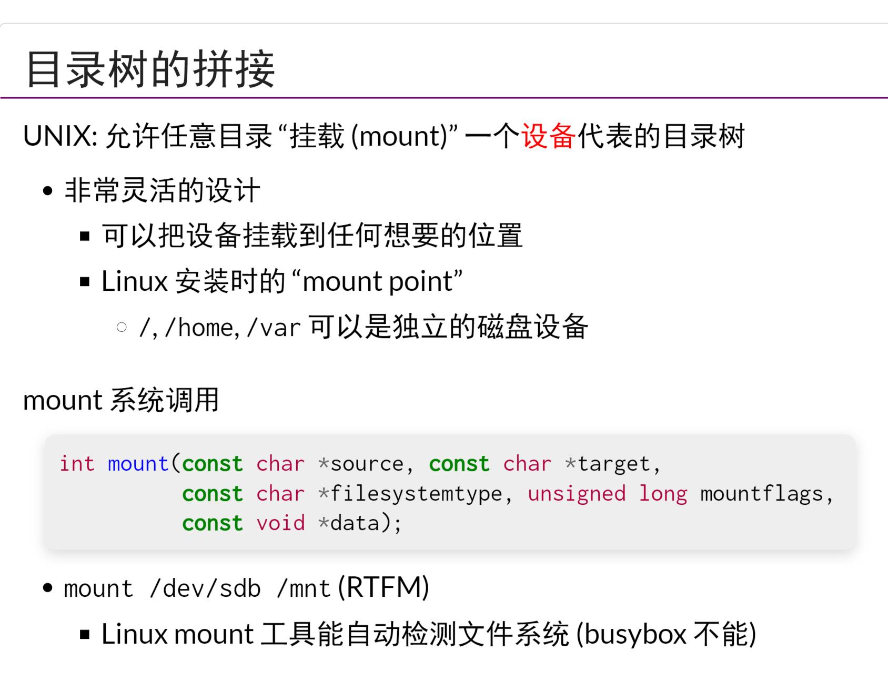,可以把一个磁盘看作是一个字节序列，mount工具是mount系统调用的封装，它可以自动检测文件系统
- linux启动文件系统，通过pivot_root实现根文件系统的切换?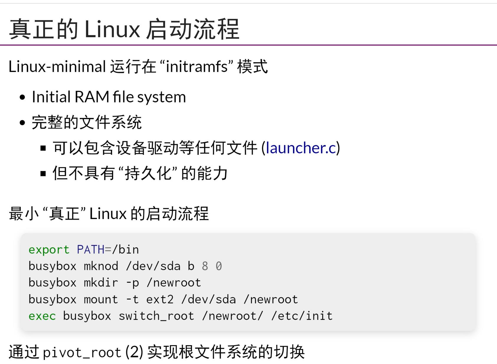
- 文件挂载的回环
    - 文件时磁盘上的虚拟磁盘
    - 挂载文件时虚拟磁盘上虚拟出来的虚拟磁盘?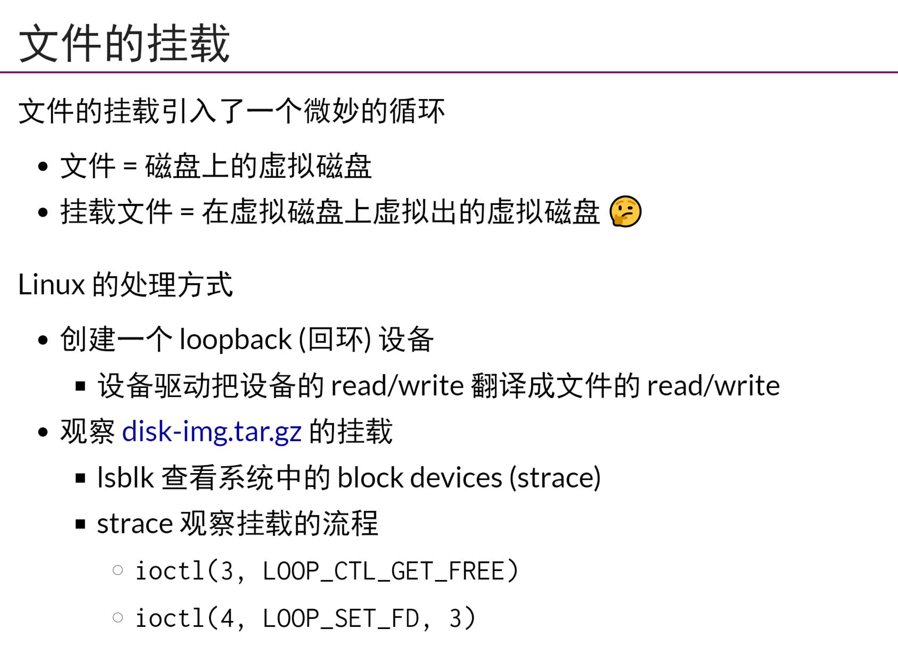
    - 实际上还是把一个目录mnt挂在到一个设备上，但是这个设备(loopback device)会把对于自己的read/write转换为virtual disk的read/write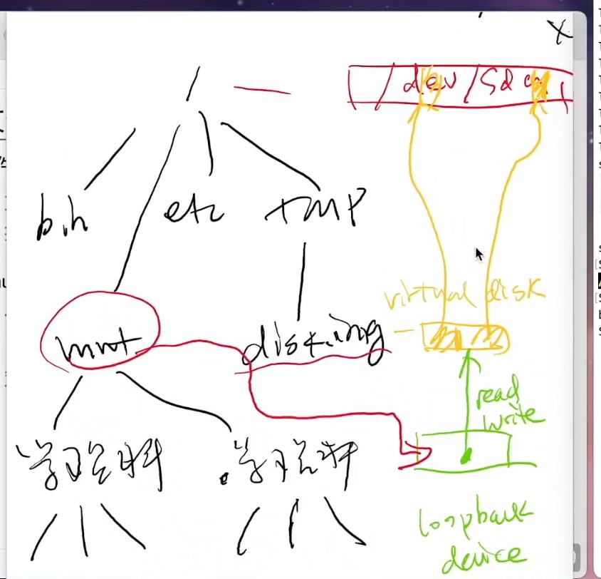
- > 简单来说，如果做过数据库的就能感觉到文件系统就是内核态的数据库，数据库其实就是用户级的文件系统
- macOS不遵循FHS
## 目录API
- C++17 fs api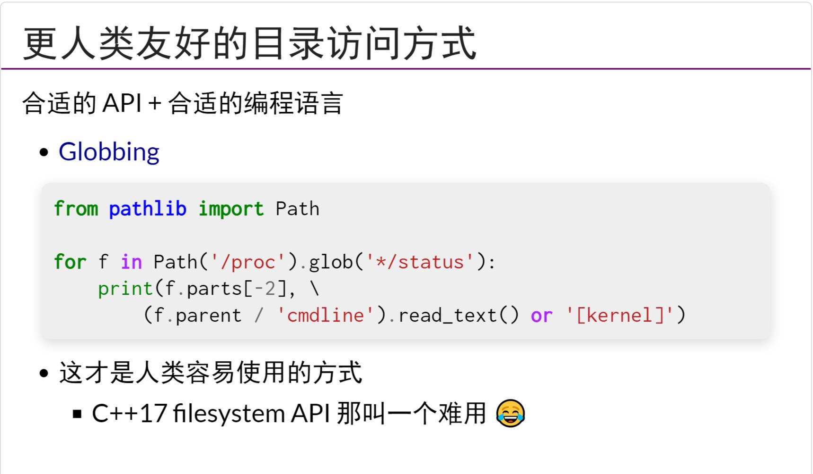
- 硬/软链接，软链接中存的就是`地址`，任意软/硬链接允许创建有向图?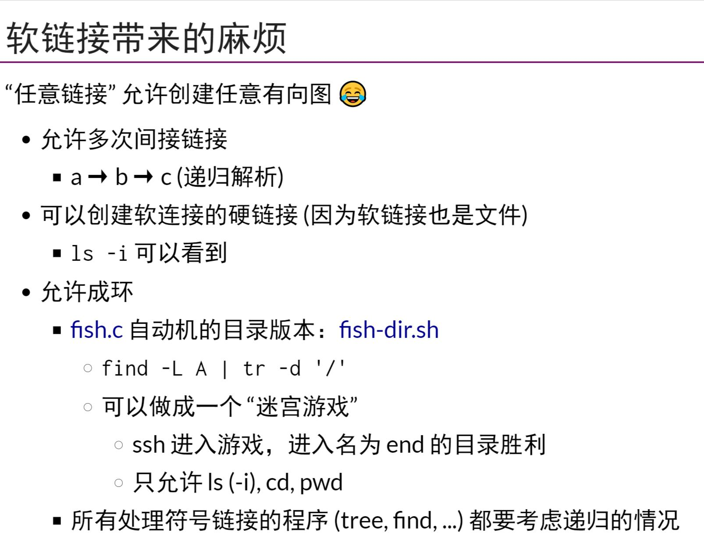
- cd是shell内部命令，不存在/bin/cd?,线程是共享working directory,还是各自独立持有一个?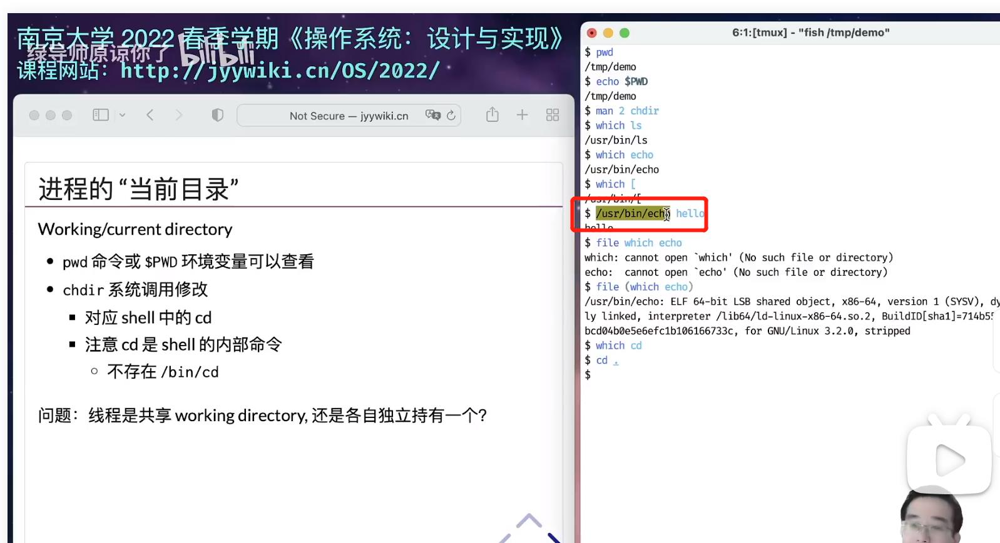调用echo会去创建一个子线程执行
## 文件API
- 文件描述符是进程访问OS对象的指针，可以通过mmap将文件中的一段内存映射到进程的虚拟内存空间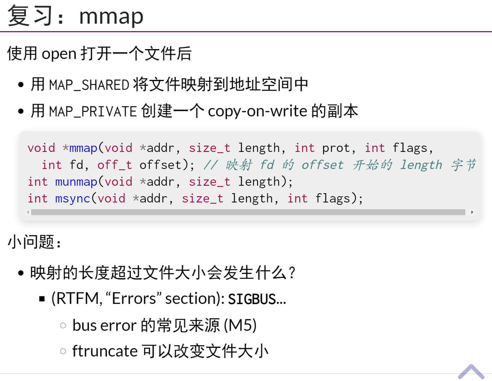
- 文件描述符就是指向文件(虚拟磁盘)，而且是指向了一个偏移量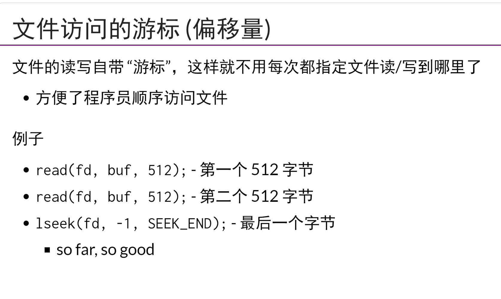父子进程共享一个文件描述符的offset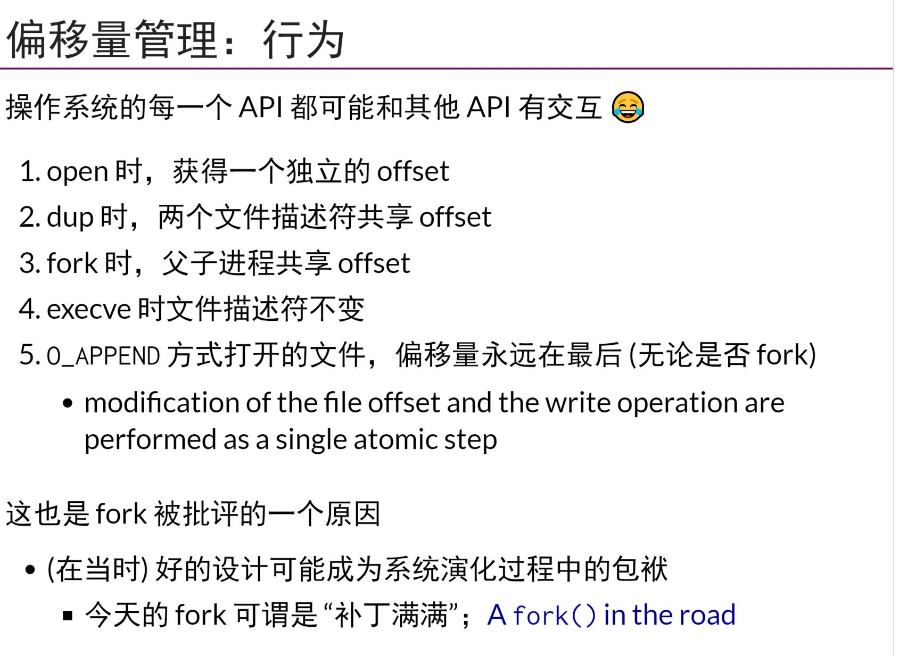