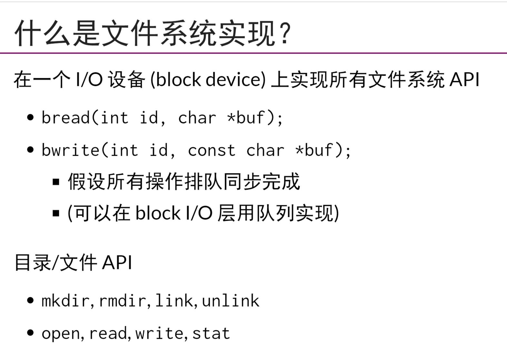
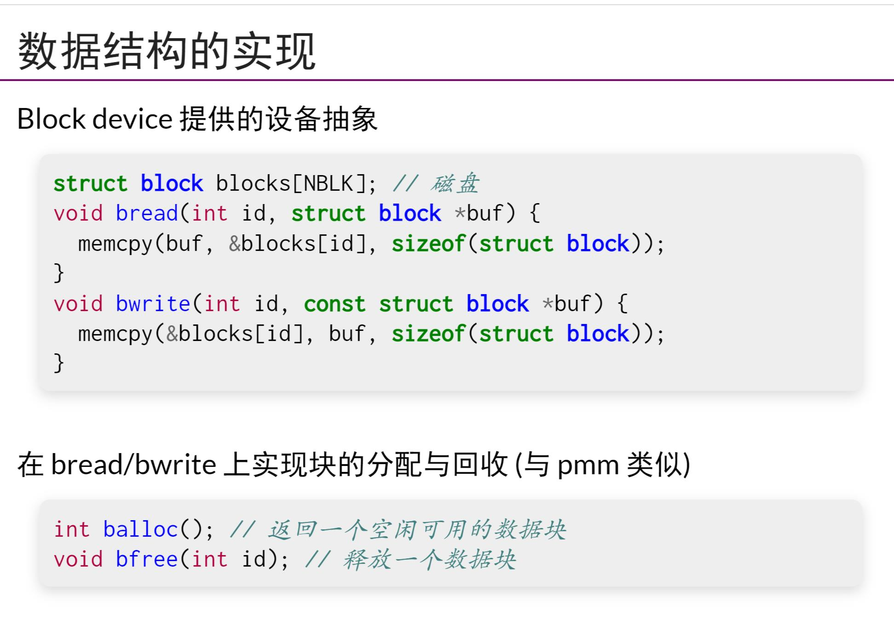
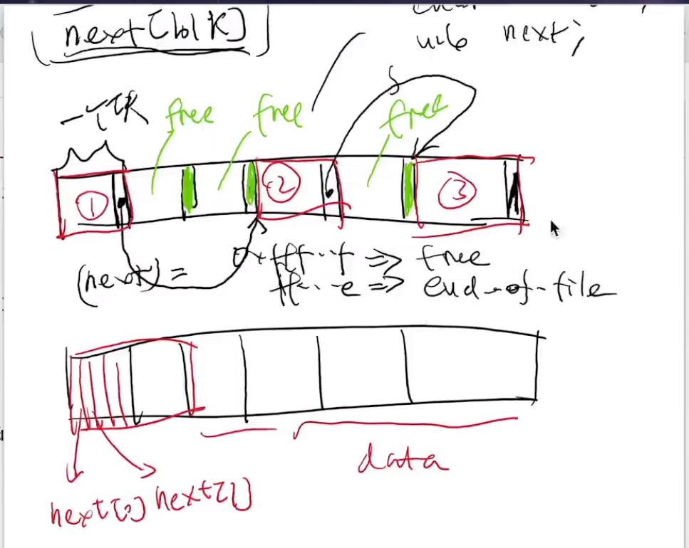
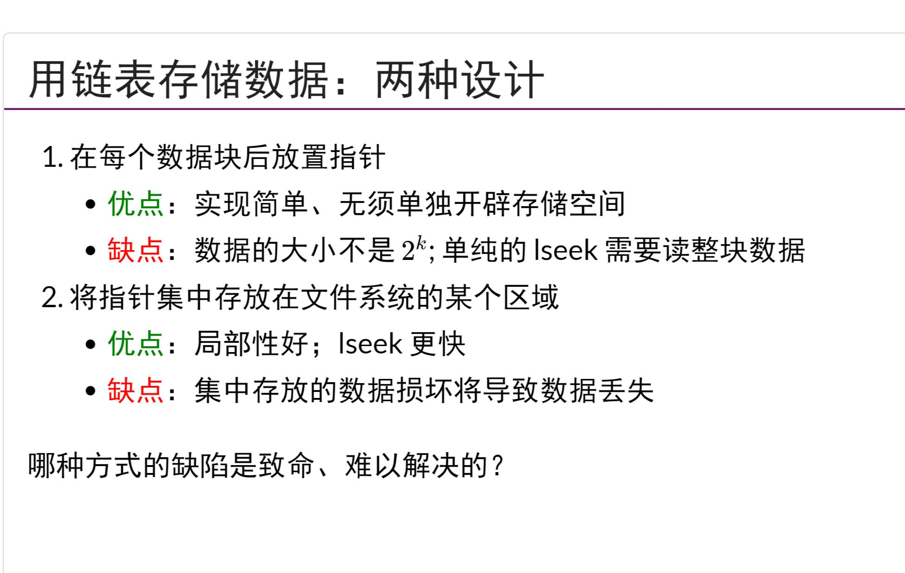
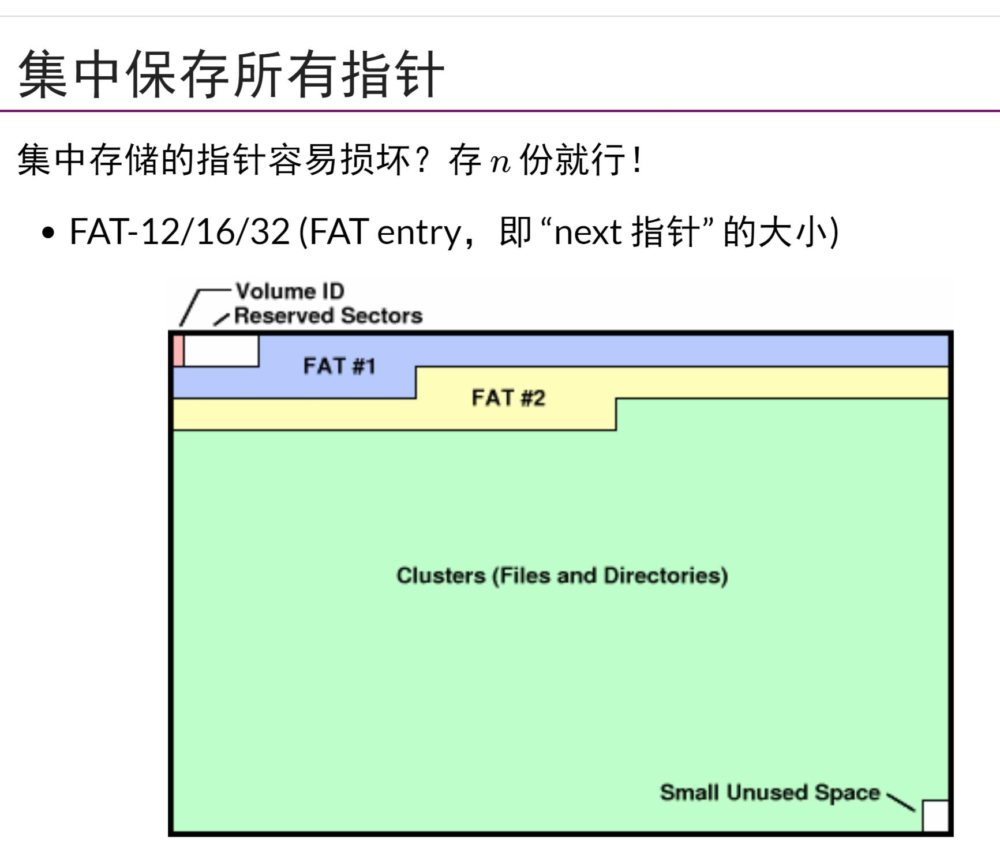
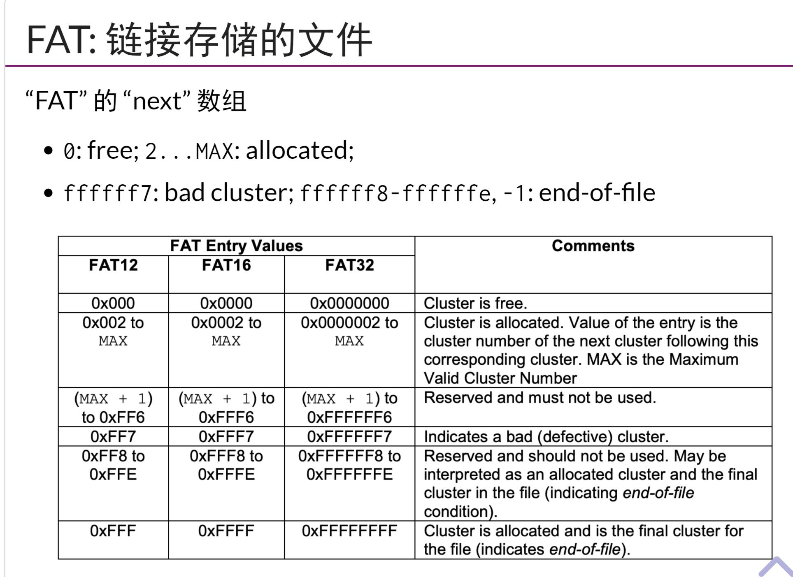
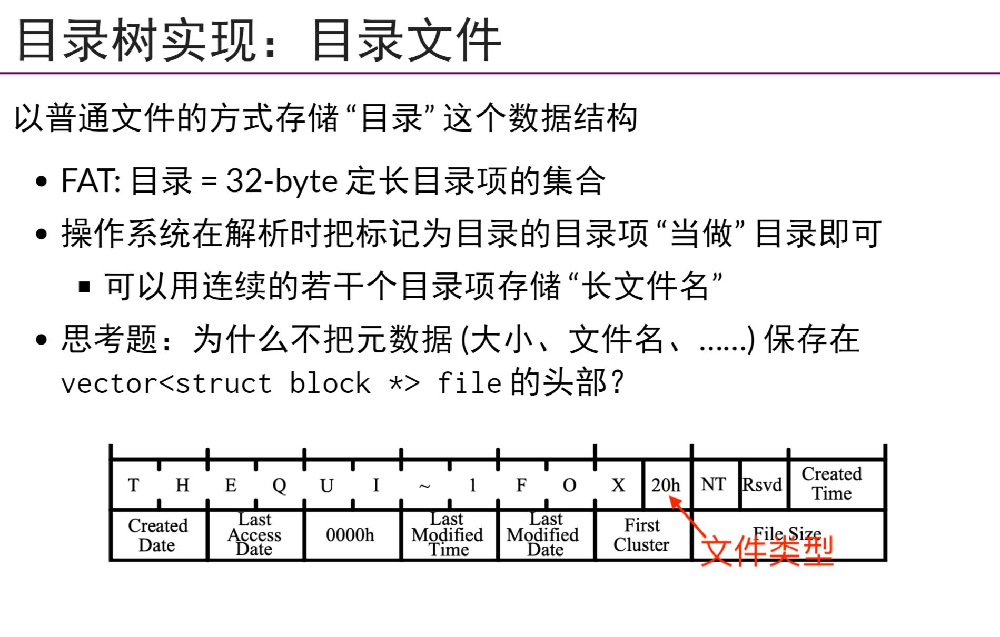
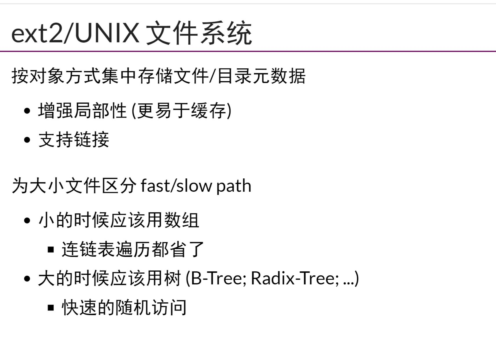
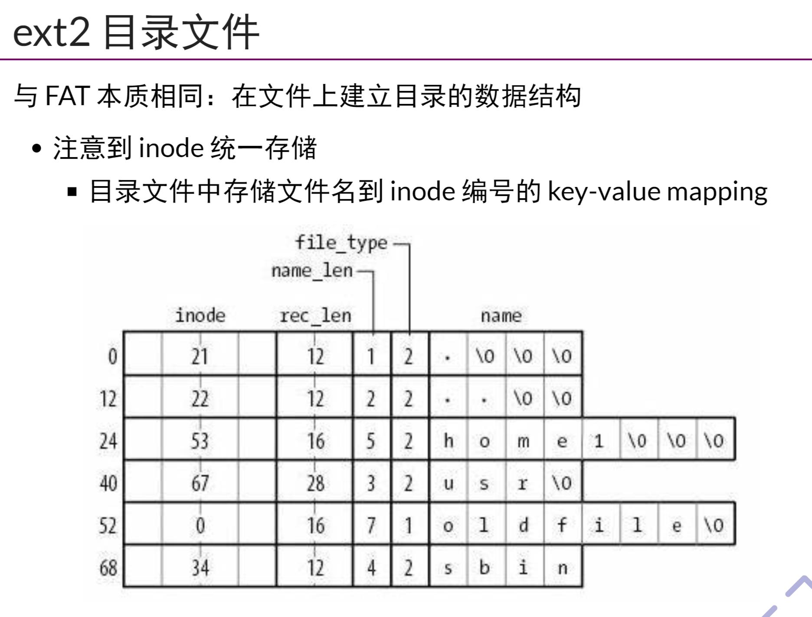

## 数据结构视角的文件系统
- 操作磁盘的API一般有`bread/bwrite`
- 一个RAM模型的假设是`读取一个word(32/64bit)`代价是O(1)
- 文件系统的假设，按块(4KB)访问，在磁盘上构建RAM模型完全不切实际，`也就是说磁盘API的底层模型不能看作是RAM了,而是一个块(block)设备?`在块读/块写的模型上实现文件系统API
- block device提供设备抽象，以block为单位做数据操作
- 由`block array`实现`block set`(block set 可以理解为一个block的allocator),在基于`block set`实现文件(也就是虚拟磁盘)，实现的文件，基于`block set`，可以实现byte array(从block set中存取数据)
- 而`目录`可以基于`文件`实现，目录文件中放很多`文件描述数据结构的entry`
- 使用链表实现`balloc/bfree`,或者使用`bitmap`来实现数据块分配与否的记录，也就是实现`block set`
## FAT 文件系统和手册导读
- U盘需要在各个OS间交换数据，FAT很通用，所以一般U盘使用FAT，UEFI分区也是FAT文件系统
- FAT中使用`空闲链表`实现空闲内存管理，这个图的绿色表示其next指针是一个特殊数字，那么说明这个块是free的。或者所有的next指针都存到最前面的block中,对于第一种方法，lseek(SEEK END)，也就是说从尾部开始找，需要线性时间的遍历但是第二种方法集中存放数据容易导致数据丢失，`单点故障`，但是可以备份解决
- FAT(File Allocation Table)采取将`next指针`存在`block 存储区`的最前面，一般存几个备份
- FAT的manual中详尽的描述了FAT的细节，可以采取一边写数据结构的方式，一边读手册
- FAT的`next`数组存有各种值来表示一个cluster的状态
- 在实现`文件`的基础上，实现一个`目录`，一个目录就是一个文件，其中存有很多`directory entry`，目录文件，为什么不把元数据(大小，文件名，...)保存在vector<struct block *> file的头部?
## FAT文件系统解析
-  大文件不适合FAT
## ext2/Unix文件系统
- 既适合小文件，也适合大文件，ext2node,ext2会对磁盘进行分组
- ext2目录文件就是在木文件中存储inode相关编号即可