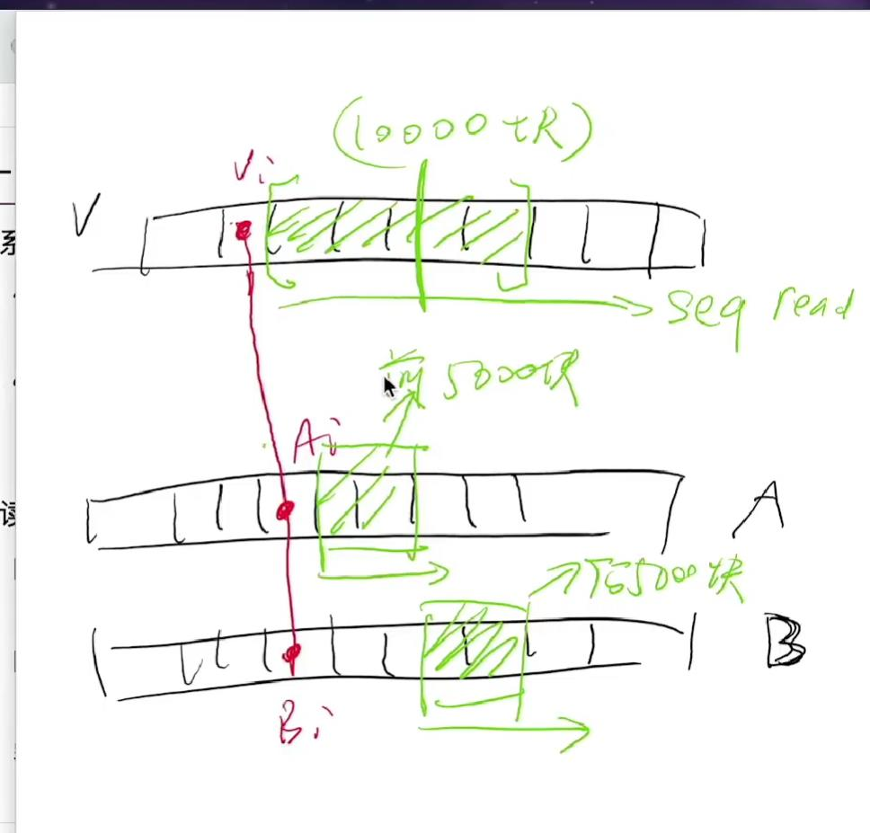

- `bwrite/bread`的实现，会去经由设备驱动翻译为设备驱动可以听懂语言。在`block array`的基础上实现FS
## RAID(Redundant Array of Inexpensive Disks)原理和设计空间
- 对于一个数组这样的数据结构，做出了一个假设，就是`内存可靠，且断电数据不会丢失`
- 对于持久存储，需要满足
    - 性能
    - 可靠性
- RAID是一个`反向虚拟化`，也就是可以把`多个相对不可靠的磁盘虚拟化成一个可靠且性能高的虚拟磁盘`
- 对于多个备份的`RAID-1`，比如线性读取，如果想要读一千块，并行读取备份A的前500块，并读取备份B的后500块,虽然存储效率变低了(也就是需要存备份),写入的效率也变低了，但是读取效率变高了
- `RAID-0`就算是不备份，也可以做到更好的利用磁盘带宽
## RAID一零/4/5
- `RAID一零`,多个磁盘组成RAID-1，之后多个RAID-0组成多个RAID-0
- `RAID-4`通过`纠错码`来实现使用一块盘，做多块盘的纠错，比如有4块盘，其中3块用来存数据，1块用来存奇偶校验
    - RAID-0部分将数据块交错分布，可以加快读取速度
    - 另外多出来的盘D，用来存储异或纠错码，比如B坏了，那么V1与V3与D的第一块异或就可以得到V2
    - 不过这种情况下，随机读写会称为瓶颈,因为每次更新随机一个块，还需要去读写对应奇偶容错块，解决方法是使用`RAID-5`
- `RAID-5`可以做到使所有盘块的一部分作为奇偶校验盘
- `Google FileSystem/MapReduce/BigTable`可以看作是把很多台不可靠的计算机，虚拟化成了一台大的可靠的计算机，它`革了所有数据中心的命`
- RAID的`可靠性`仍然有待加固
## 崩溃一致性,FSCK和日志
- 在文件系统的模型中，如果要向一个文件中写一个数据，那么其实要更新好几个块，`日志的顺序读写与记录小的特点使得崩溃后的可靠性的到了保证`
- 磁盘不保证`all or nothing`,甚至不保证`bwrite`的顺序，比如你请求写120,100块，它有可能去先去写第120块，`bflush`可以实现磁盘同步，但是很慢
- `FSCK(File System Checking)`,根据磁盘已有信息，恢复出最可能的数据结构
- 数据结构存在两种视角，
    - 直接的状态表示
    - 所有对于记录数据的`修改添加`
- 所以可以使用`日志(redo/undo log)`，日志先入盘(WAL)
- 需要实现`atomic append`,来达到原子的添加日志的功能
- journal有各种优化
    - 比如xv6将多次系统调用的文件写合并成一次写
    - ext4中不再会去标记TxBegin/TxEnd，而是同Tx的长度和checksum来查看一次Tx日志是否正确