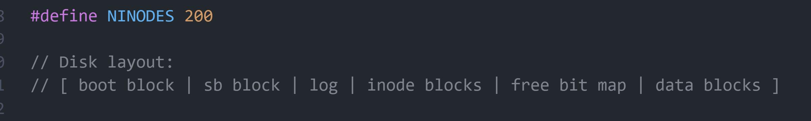
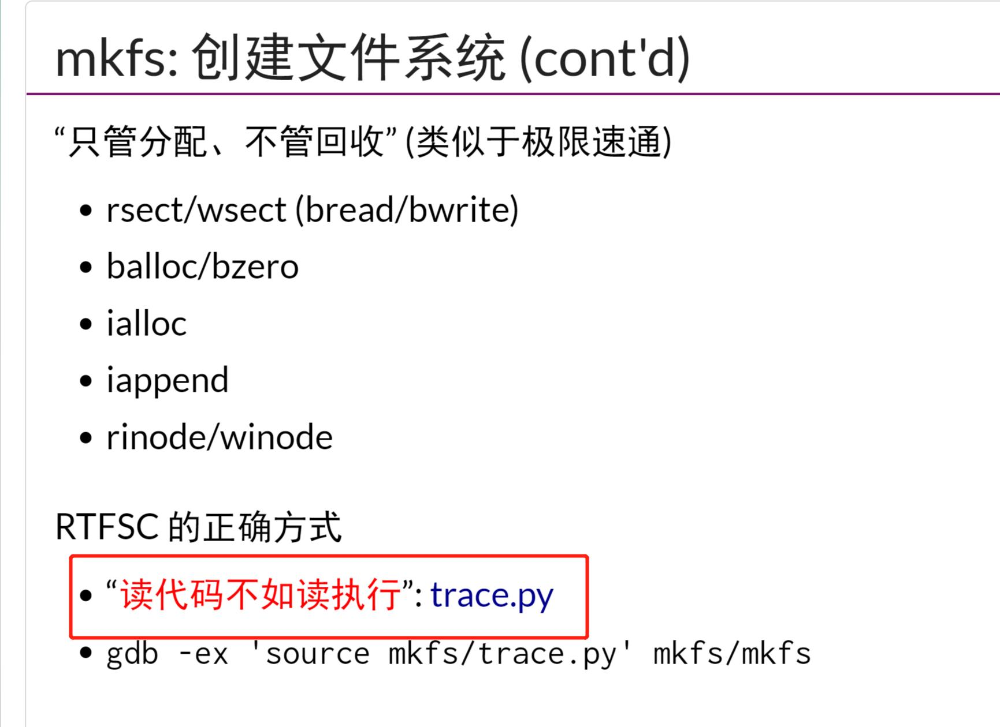
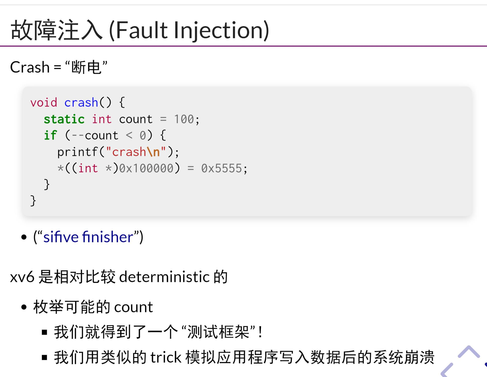

- 对于一个指针的解引用，可能会速度不一致，因为磁盘读写是以一个block为单位的
## 复习:文件系统的实现
- FAT主要由多个备份的Next指针以及`文件与目录`组成
- 对于FAT，一个文件的内容不是连续存放的，如果想要遍历大量的文件，会把很多多余的块读到内存中
- Unix文件系统ext中，有一处专门存储`inode`的区域，`inode`中存有大小，属性，数据块指针等，但是不会存储`文件名`,因为多个软连接可以指向同一个`inode`
- ext文件系统中有个SuperBlock文件块
## mkfs.c 和 trace
- xv6的fs中存在一个`bootblock`其中`free bit map`中存储的是整个文件系统块的使用情况
## Buffer Cache
- xv6中`mkfs`会创建文件系统
- xv6中存在一个`Buffer Cache`,充当磁盘缓存，每次系统调用bread/bwrite时，根据buffer cache中是否存在目标块，而读写缓存或者磁盘，而磁盘的`block array`实际上是一个包含`boot block, super block,log,inode blocks, free bit map, data blocks`的抽象
## Log
- r5中有一条指令`*((int *)0x100000) = 0x5555;`往这个地址中写入0x5555,虚拟机会关闭