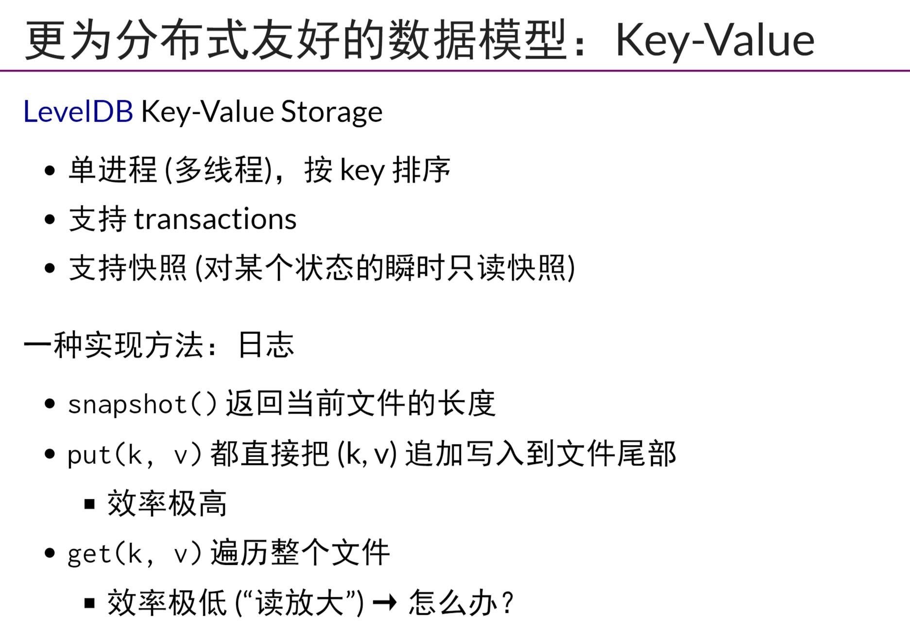

## 文件系统的优势和局限
- 在Unix中IO设备被抽象为`文件`
- 文件系统`非常直观`,并且有许多Unix工具/标准库可以处理文件
- 但是文件系统可扩展性差，低可靠性
- 也就是说文件系统相比较与数据库，缺乏`原子性`与`性能差`
## 关系型数据库
- everything is a table,计算机数据可以看作是现实世界在信息世界的投影，在关系型数据库中，`二维表`是一个好的抽象
- 数据库保证ACID
- 数据库的实现是    
    - 将SQL查询翻译成为read，write，lseek，fsync的调用
    - 并发控制(事务处理) 
## 分布式存储
- datacenter,数据中心(一个机房机器的数量)*网络速度，就是这个系统能够容纳的数据的数量
- 随着互联网数据的海量增长，关系型数据库不在适用
- 传统数据库`Oracle/MySql`一般只支持单机,也就是支持CAP中的CA;,或者允许一定的不一致，也就是只支持`AP`，比如Cassandra,Amazon一度允许不一致性;或者允许一定的延迟，比如Google BigTable。构造一个plant-scale的数据需要一个类似`SLED(Single Large Expensive Drives) v.s. RAID`的创新
- 相比较于与`table`的数据模型，更友好的分布式数据模型是`Key-Value`。LevelDB
    - 每次写都只是把(k, v)追加到文件尾部，效率高
    - 但是读类遍历整个文件`读放大`，就是指比起直接读取要耗费更多功夫；还有`写放大`，比如数据库中要写一个记录，附带的还要写索引和log等，插入指定位置也是写放大，要移动后边的数据;`存储放大`就是指存数据副本
- levelDB解决写放大的方法是`LSM(Log-structed Merge Trees)`,`B+树是读友好，LSM树是写友好`
- TiDB就是`etcd(raft) + rocksdb`，而rocksdb就是改进版本的leveldb