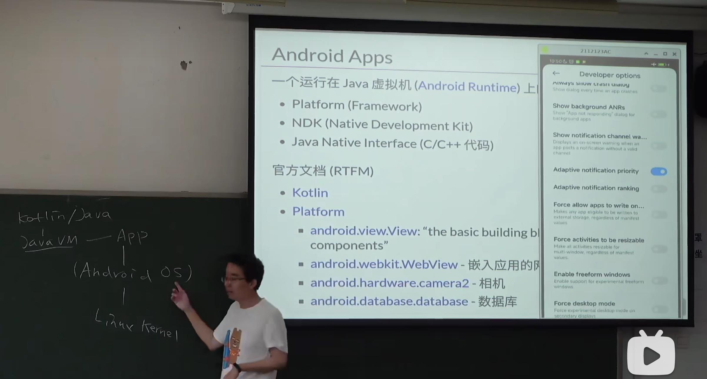
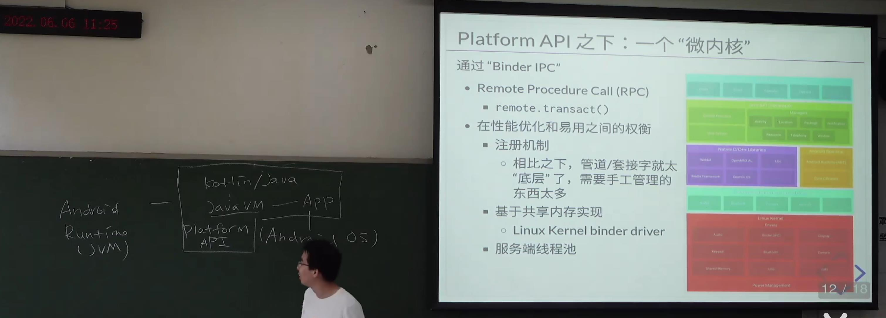
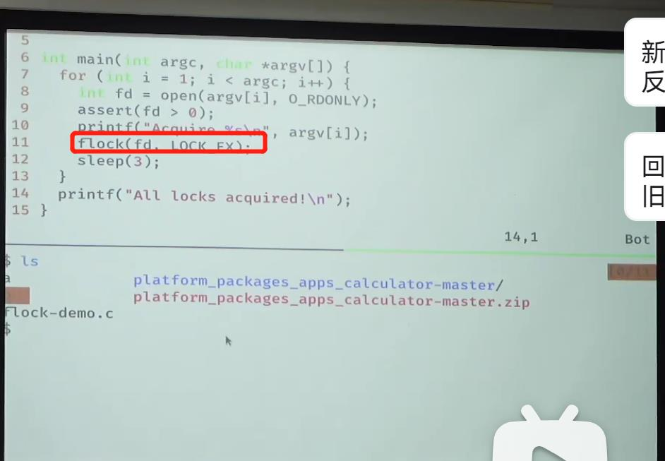
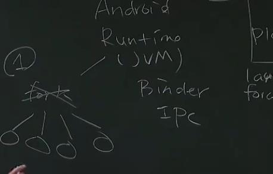

## 走向移动互联网时代
- JAVA的虚拟机是一个stack machine，所有东西都是存在栈上，它的体系结构中没有寄存器的概念
- Android使用的是JAVA，而诺基亚的塞班使用的CPP，所以没有办法适用与大量开发者，并且虽然JAVA慢，但是由于摩尔定律，Android赌赢了，但是近来摩尔定律开始失效，高通的arm也像intel一样，遇到了瓶颈
- 每一个手机上的应用都是一个linux进程
- `只要是为上层提供服务，管理下层资源`的系统就可以理解为OS
- `Andriod Runtime`为每个应用都提供了一个数据库sqlite
## Android 应用
- 
## Android系统与后台保活
- 安卓的launcher也是一个应用程序。
- Android Runtime是一个JVM，其中包括`Kotlin/JAVA,PlatforAPI等`
- Android使用`Binder IPC`类似RPC去实现服务的提供
- Android的服务器提供者，容易发生`进程优先级反转`
- `flock`可以把文件系统里的文件当成一个🔒
- `double fork`可以使得子进程成为1号进程的子进程一个进程发信号，所有子进程都会收到信号