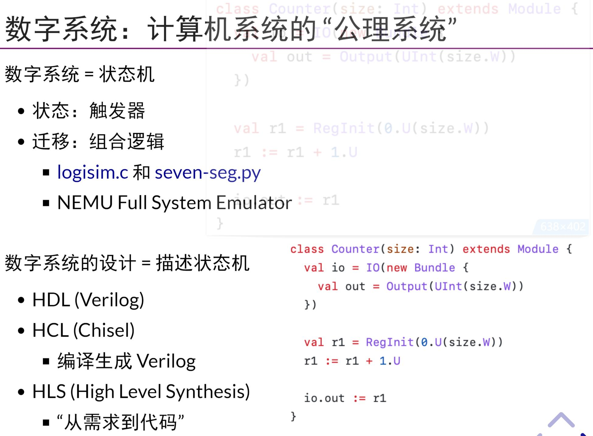
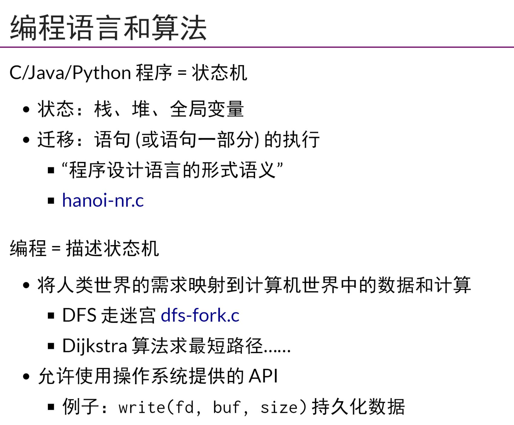
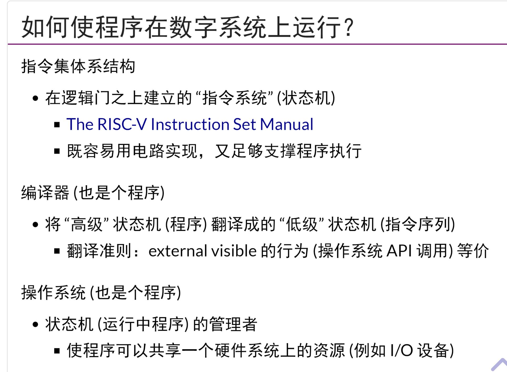
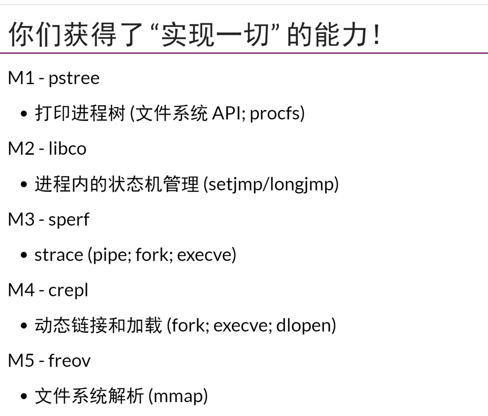
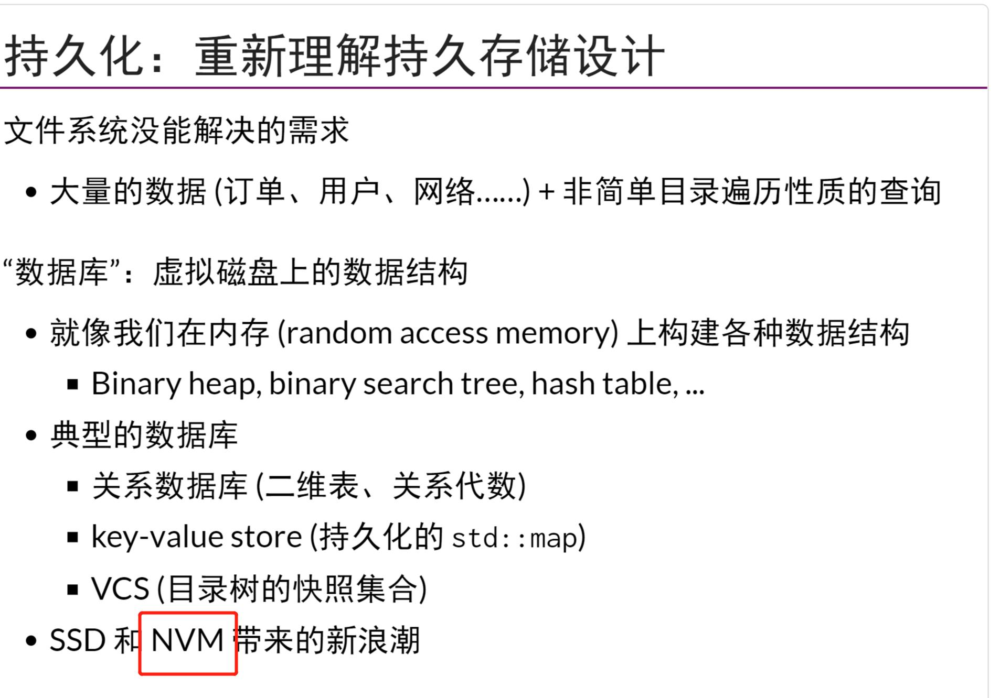
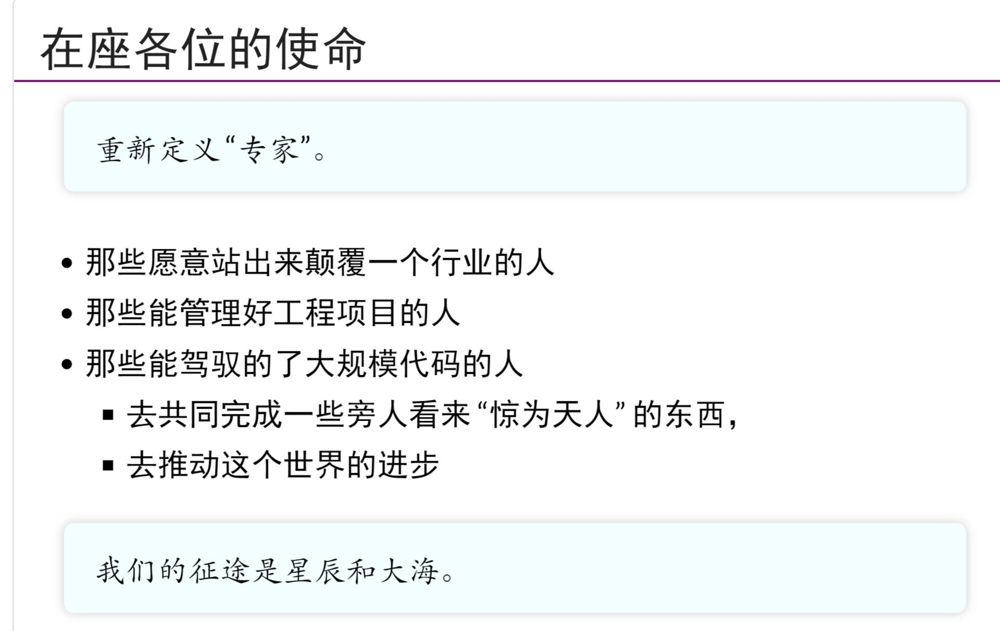

## 从逻辑门到计算机系统
- 数字系统就是一个状态机，`Chisel`面向对象，是比Verilog更好使用的`HDL`
- 使用C/Java/Python程序来描述状态机
- 如何使程序在数字系统上运行，
    - `OS`是状态机(程序)的管理者，使得程序可以共享一个硬件系统上的资源，`可以将一个程序加载到CPU`上执行
    - `编译器`将高级状态机(程序)翻译成为低级状态机(指令序列)，翻译准则是external visible的行为(操作系统API调用)等价
    - `指令集结构`，在逻辑们之上建立的`指令系统`(状态机),既容易用电路实现，又足够支持程序执行
- 所以OS就是一个syscall的提供者，以及程序状态机的管理者
- `ld命令`默认会生成`a.out`
- jyy的OS的实验
    - 打印进程树，协程库，strace，动态链接和加载，文件系统解析mmap
- `查看执行比查看代码更好理解`
- 可以用perf查看一个a.out执行了多少条指令
## 走的更远
- 对于`microkernel`，完全可以把诸如`文件,进程等服务器`放到用户态，这样`microkernel`更安全
- Intel的optane nvm支持按照字节寻址，那么有可能可以替代当今的`DRAM`，虽然数据上慢3倍[intel optane](https://zhuanlan.zhihu.com/p/111502563),那么未来可能`block device`的假设就不对了，虽然现在HDD，SSD都是`块设备`
- 我们这一代人需要定义什么是专家！！！