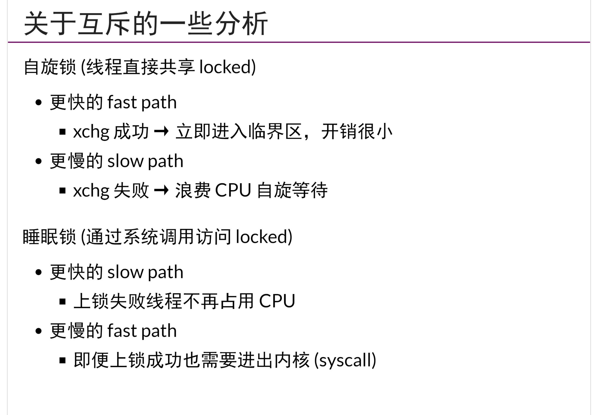
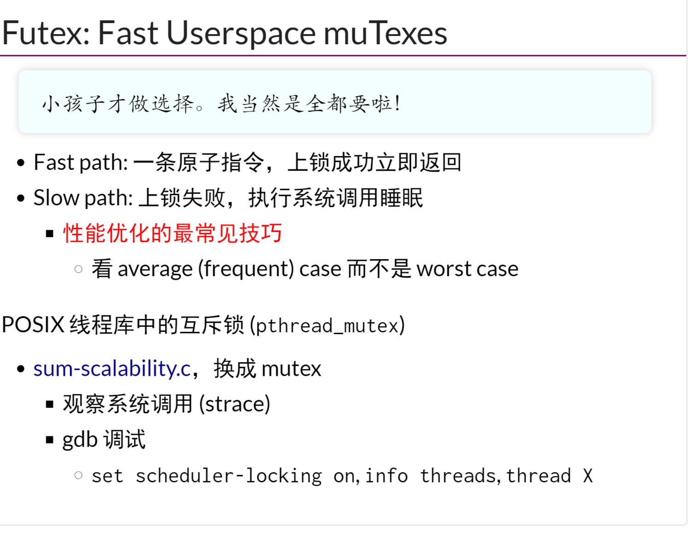

## 互斥问题分析
- 实现互斥的困难在于`不能同时读/写共享内存`
## 自旋锁
- `xchg`指令是一个由硬件支持的最小的`原子的load&store`，也就是将内容读出再存入，将两个数值交换
```cpp
// 简单互斥锁实现
int lock = 0;
void lock() { while(xchg(&locked, 1)); }
void unlock() { xchg(&locked, 0); }
```
- 自旋锁适合
    - 临界区几乎不`拥堵`
    - 持有自旋锁时禁止执行流程切换
    - 比如`操作系统的内核的并发数据结构(短临界区)，不允许用户态自己决定自己是否可以释放🔒`，OS可以通过`关闭中断/抢占`，但需要保证锁的持有者短时间内释放🔒
- x86架构使用`MESI`协议使得每个核的L1 cache(L2/L3是共享内存)对于其他核具有可见性，通过`MESI`加锁保证每个核的`L1 cache`的一致性
## 互斥锁
- `自旋锁`的缺点在于性能低，空耗CPU资源
- `互斥锁`可以实现`线程和长临界区的互斥，空闲让进`
- 使用`syscall(SYSCALL_lock, &lock)`实现获取🔒，`syscall(SYSCALL_unlock, &lock)`释放🔒
## futex(Fast Userspace muTexes)
- `自旋锁`具有更快的fast path，更慢的slow path
- `互斥锁`相反

- `futex`,slow path和fast path都很快,