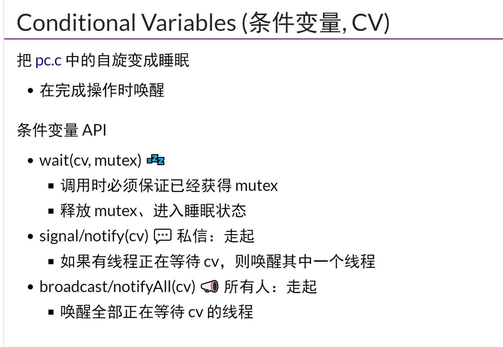
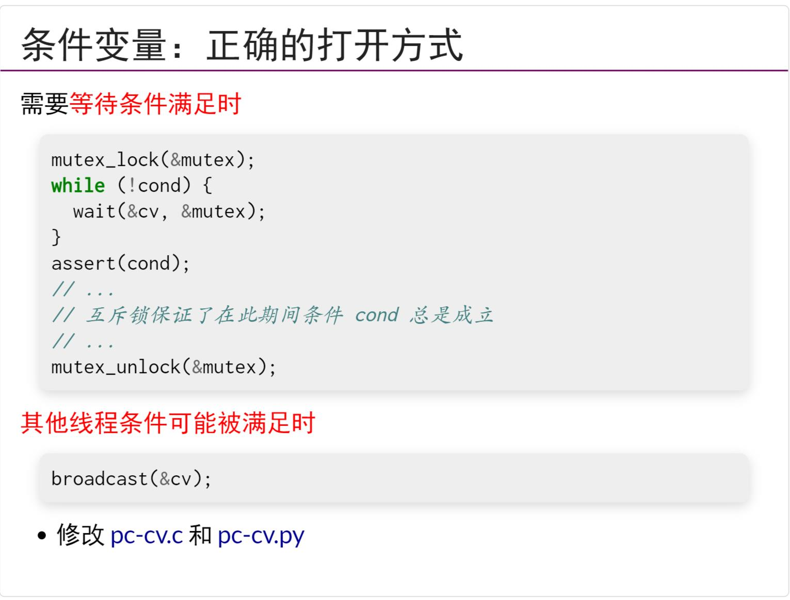
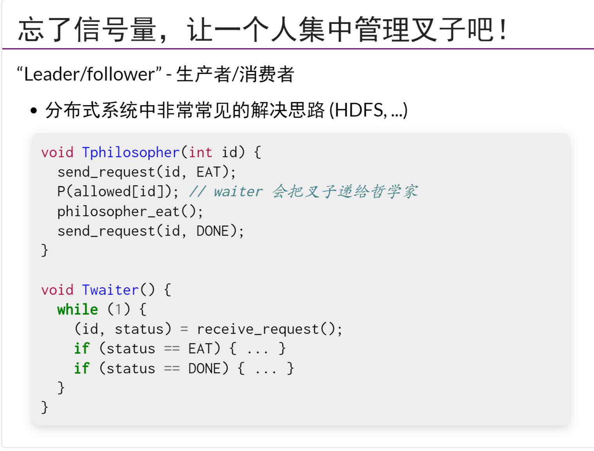
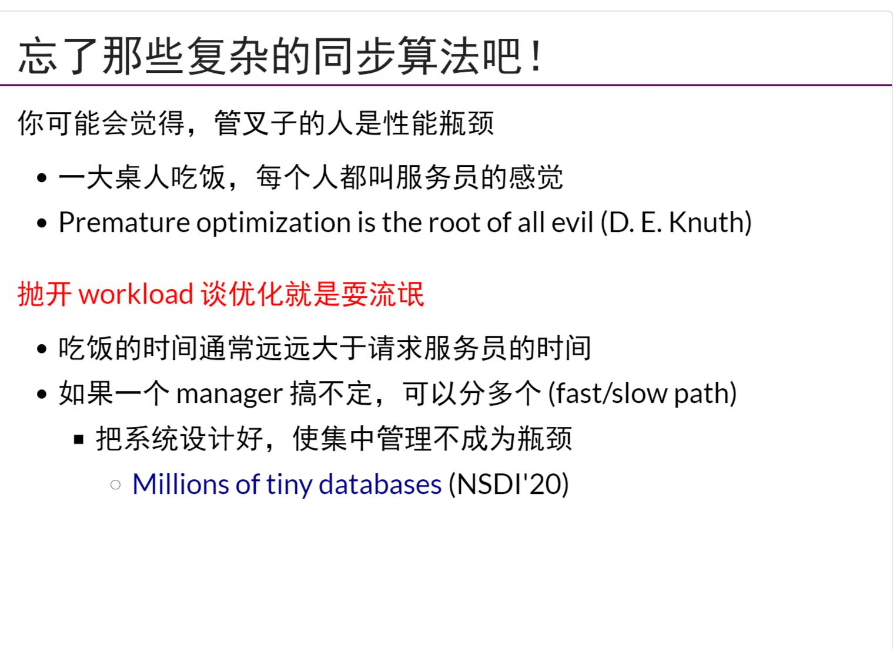

## 生产者-消费者问题
- `同步`，两个量随时间变化的时候，保持一定相对关系
- `异步`就是不同步
- `线程同步`，在某个时间点上共同达到互相已知的状态
## 条件变量实现同步
- `join`就是同步的一种体现，它使得调用该函数的方法去`等待其他线程执行完`
- 条件变量`cv操作`
- 在生产者消费者问题中，如果存在多个消费者生产者，会出错！！！所以一个万能的`条件变量的使用方法`是使用`while`
- `条件变量`在这节课中，相对于互斥锁，只是没有`自旋`
## 信号量
- 可以由`互斥锁`+`计数器`实现
## 哲学家进餐问题
- 除了`信号量`,还可以使用分布式的算法master/slave的方法解决该问题,甚至master节点(也就是这里的waiter)可以对哲学家增加统计数据，比如如果一个哲学家长时间占用资源，那么可以下次降低该哲学家优先级
- 在分布式系统中，`复杂的，优化过的同步算法`反而是一种拖累