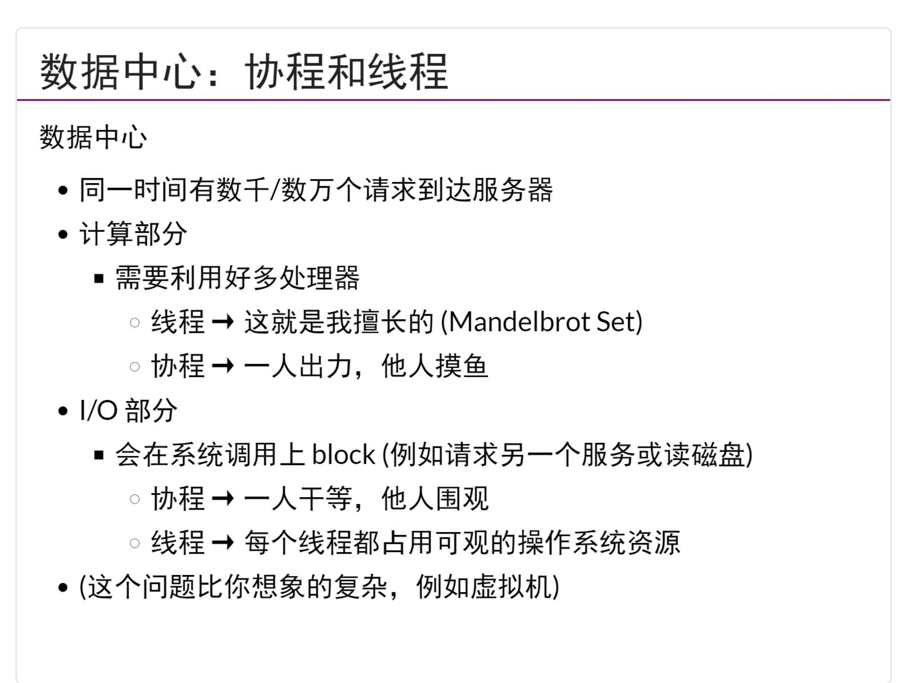

## 高性能并行计算
- `MPI`是一个`消息传递库`
- `OpenMP`是一个`多平台共享内存并行编程库`
- 线程间的通信还发生在`任何共享内存`间
- `超算`主要应用是`模拟/AI`
## 数据中心与并发系统调用
- 数据中心以`数据(存储)为中心`
- OLAP,如果需要做一个以数据为中心的应用，那么CAP是主要挑战，P(Partition tolerance)指的是当网络故障时，系统就需要在C与A之间做选择
### 线程与协程
- `协程`是用户态进程，那么就不能实现`并行`只能实现`并发`,所以在数据中心的场景下，就需要利用好多处理器，所以使用`线程`比较好
- Go语言使用的线程`Goroutinue是线程和协程的结合体`，执行到blocking API的时候(比如sleep，read)，Go Worker会改成non-blocking版本
- `Do not communicate by sharing memory; instead, share memory by communicating`，可以理解为`不要去自己使用共享内存，而是在通信的使用共享内存API`
## Web 2.0时代
- Ajax异步编程，使得浏览器可以实时渲染
### 单线程+多事件模型
- 