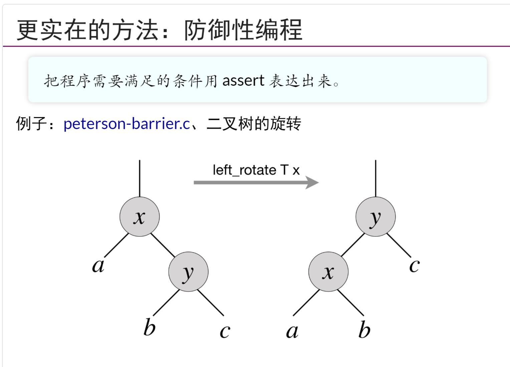
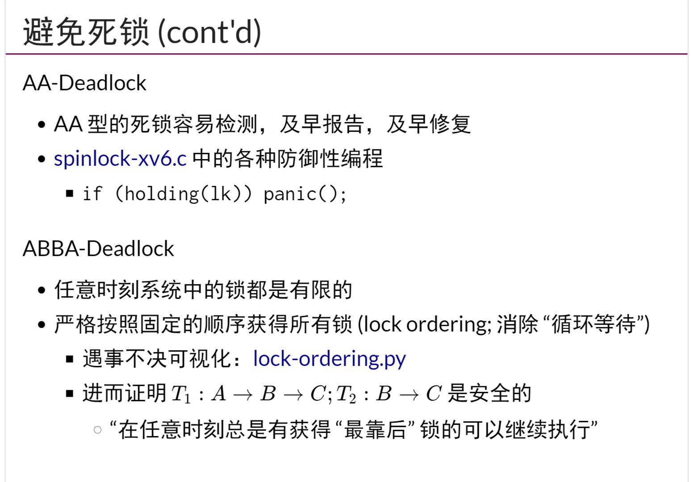
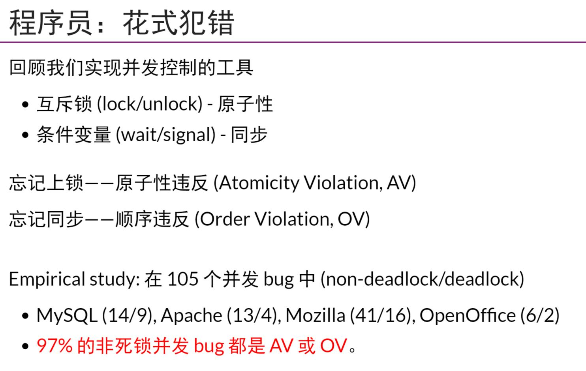
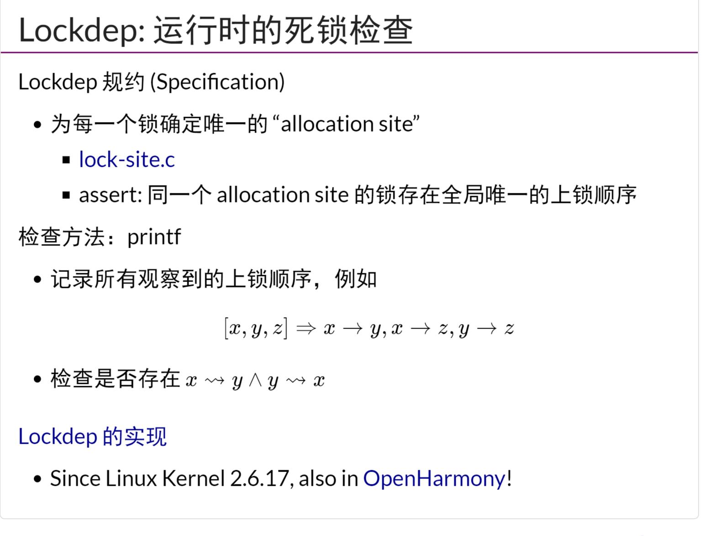
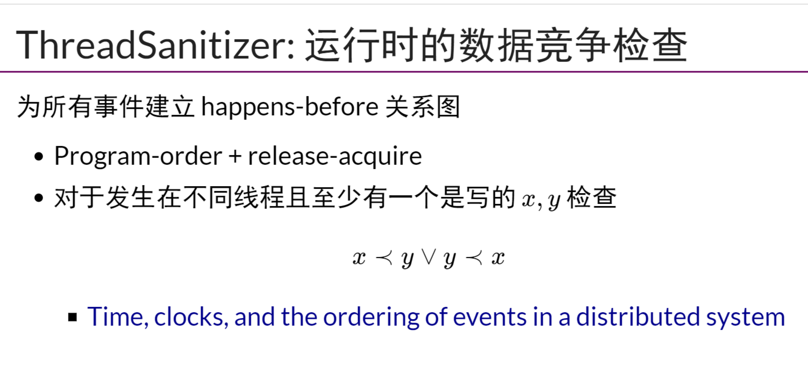
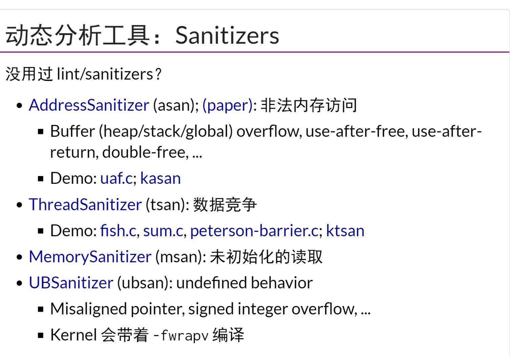
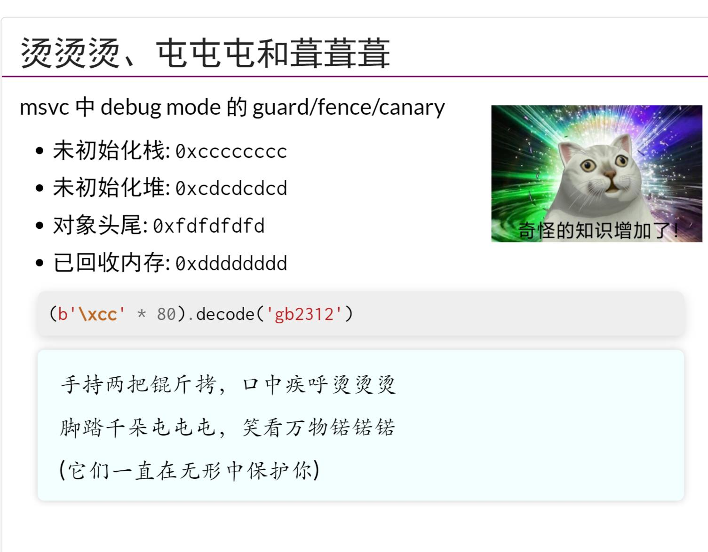
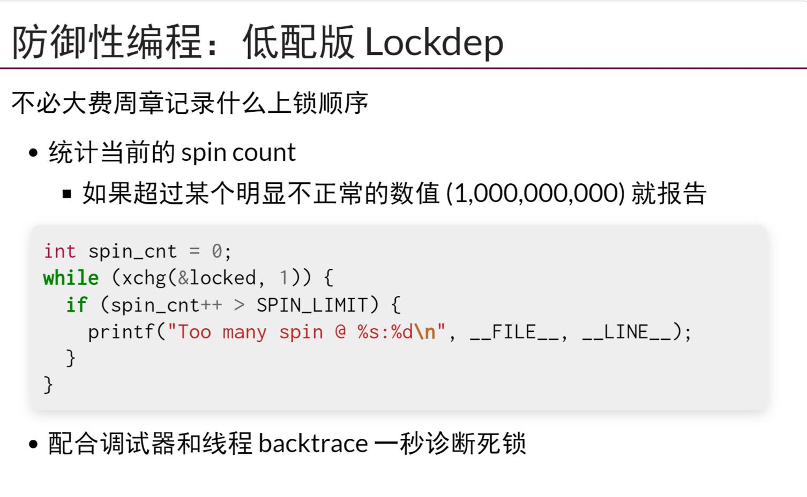
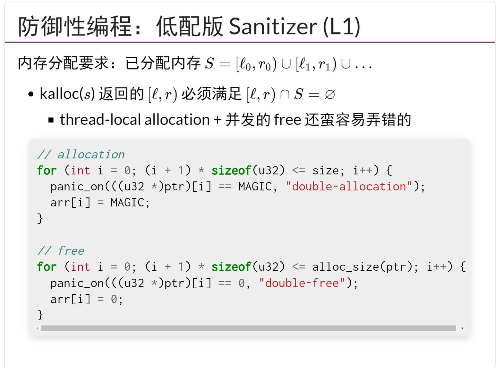

## 防御性编程
- 一个要点是`把程序需要满足的条件用assert表达出来`，
- 在实现os kernel的时候，如果指针错误，没有程序会帮助检查，所以及时的`panic/assert`很有必要
## 并发Bug:死锁
- 一个解决死锁的办法，所有线程都按照固定顺序去获得锁(Lock Ordering)
## 并发Bug:数据竞争
- `非死锁并发Bug`一般就是OV和AV
- `lockdep`，Linux死锁检测模块，确保lock ordering
- `ThreadSanitizer`
- `Sanitizers`，在gcc编译时，增加相关编译选项，可以省时省力`gcc -g test.c fsnitizer-address`
## 自己实现运行时检查
- `msvc`中实现的`canary`
- 低配般`Lockdep`，也就是增加计数
- 低配版`Sanitizer`，也就是类似`canary`