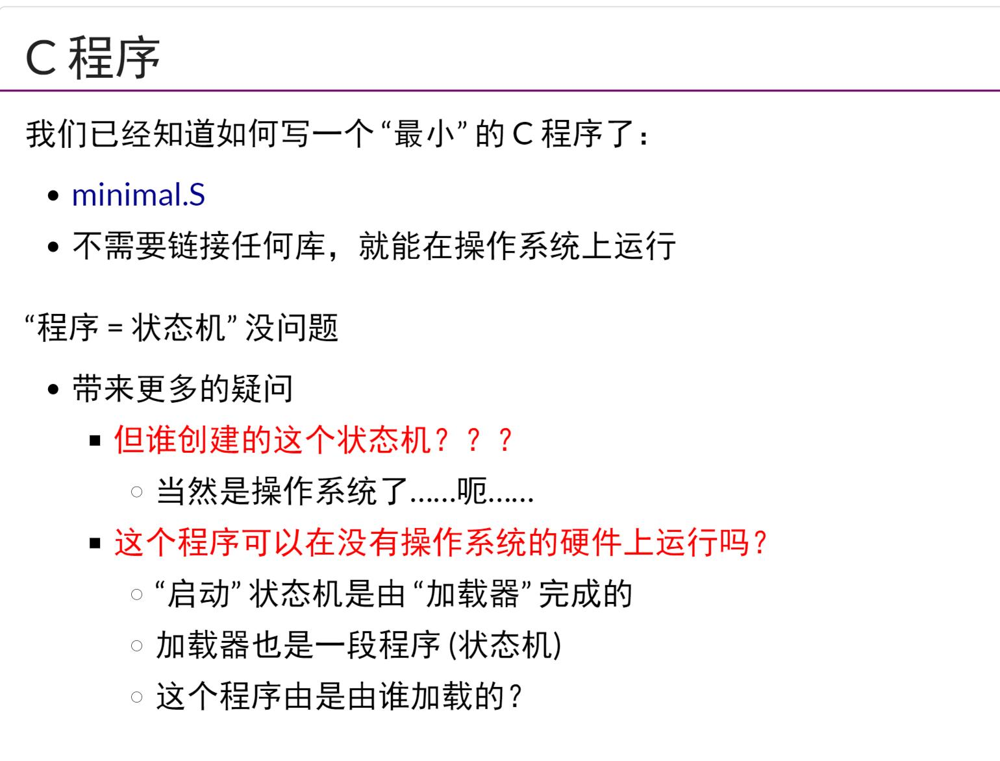
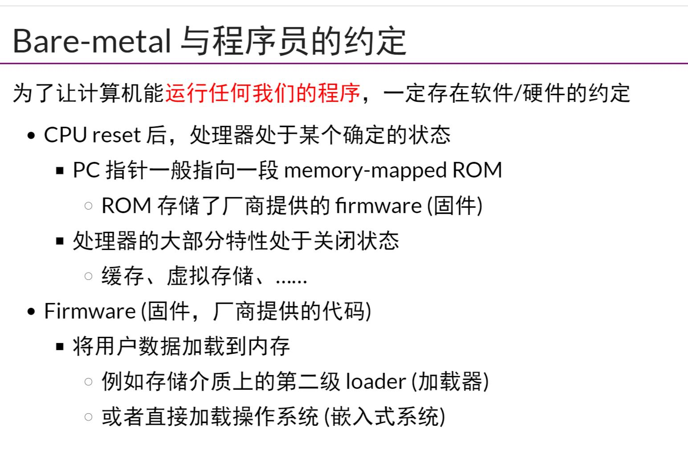
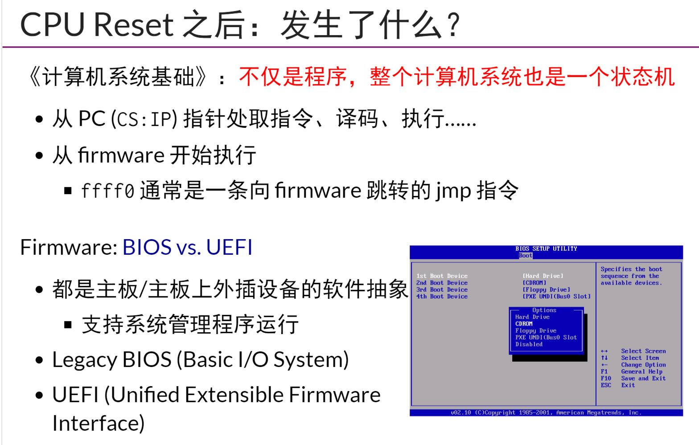
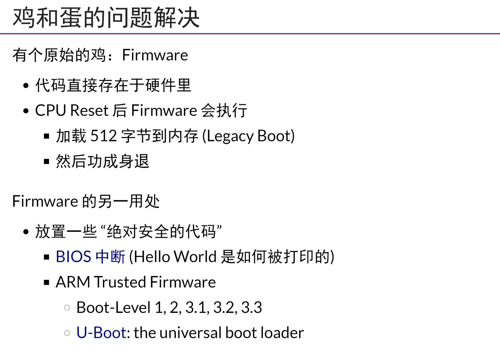
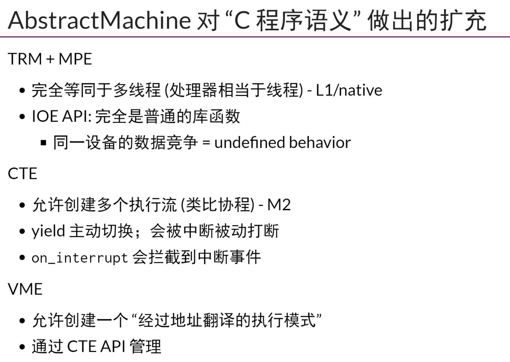

## 小/大学生的OS
- 天赋在专业人士面前不值一提
## CPU Reset
- OS可以将一个`最小`的C程序装载运行，不需要链接其他库
    - 但是程序可以直接运行在没有OS的硬件上吗？`启动`程序状态机是由加载器完成的，那么加载器这个程序也需要其他程序加载，一般是通过`自举`。
- 在CPU reset(也就是所有电路回到初始状态)之后，那么硬件厂商会规定好`PC`的初始值，初始时，处理器的大部分特性处于关闭状态(实模式)通过fireware,legacy BIOS(遗留系统)/UEFI。
    - 一开始，PC(CS:IP)指向0xffff0处，这里一般是条通向firmware的跳转jmp指令
    - 启动时，BIOS将MBR装载到`0x7c00`处
## thread-os和状态机模型
- AbstractMachine对于C程序语义做出扩展
